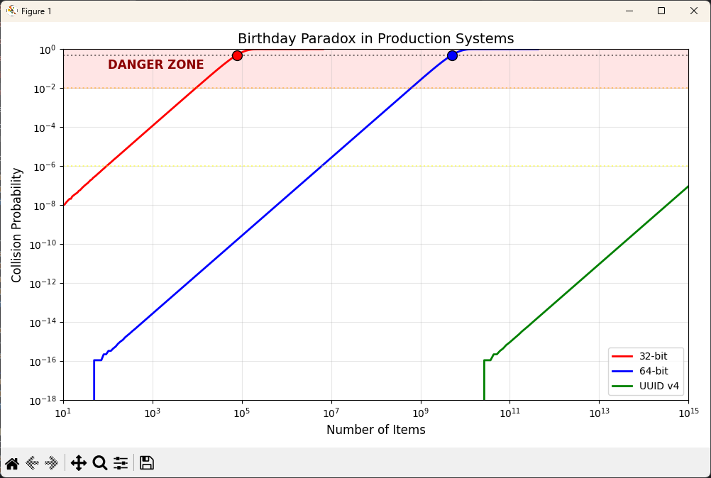

+++
title = "The Birthday Paradox in Production: When Random IDs Collide"
subtitle = "Why collision risk grows faster than intuition suggests, and what that means for IDs, hashes, and distributed systems"
date = "2025-11-28T06:00:00-07:00"
draft = false
categories = ["Applied Modeling and Simulation"]
tags = ["cryptography", "databases", "distributed-systems", "probability", "Python"]
author = "Tom Archer"
listThumb = "birthday-paradox.png"
hero = "birthday-paradox.png"
whatYoullLearn = [
    "Why collisions happen long before an ID space is full",
    "Why collision risk grows much faster than intuition suggests",
    "How the birthday paradox applies to computer systems",
    "How to calculate the probability of an ID collision",
    "Why the square root of the ID space determines the danger zone",
    "How 32-bit, 64-bit, and UUID v4 IDs compare",
    "How generation rate changes the time until collisions become likely",
    "How to choose an acceptable collision risk for a real system",
    "How Monte Carlo simulation can validate collision calculations",
    "How to predict when an ID strategy needs to be replaced"
]
+++



You generate a . It's 128 bits total, with 122 bits of randomness. That's 340 undecillion possible values. Collision-proof, right? Your system generates a million IDs per second. Still safe? What about a billion?

As I like to say, *common sense and intuition are the enemies of science*. Common sense tells you that with 340,000,000,000,000,000,000,000,000,000,000,000,000 possible values, you'd need to generate at least trillions before worrying about duplicates. Maybe fill 1% of the space? 10%?

Math shows us the uncomfortable truth: You'll hit a 50% collision probability after generating just \\(2.7 \times 10^{18}\\) IDs. That's 0.0000000000000000008% of your total space. At a billion IDs per second, you've got 86 years. Comfortable, but not infinite. Drop to 64-bit IDs? Now you've got 1.4 hours. Just enough time to duck out for long lunch and return to a disaster. And 32-bit? 77 microseconds. Faster than you can blink.

You might know that the  proves that just 23 people have more than a 50% probability of sharing a birthday. What you may not know is that this isn't just a party trick; it's the same mathematics that determines when your "guaranteed unique" database IDs collide, why  need careful sizing, and when your 's assumptions break.

The paradox reveals why intuition fails us:  doesn't grow linearly with usage; it grows with the square. Double your data, quadruple your risk. This quadratic growth is why systems that run perfectly for months suddenly start failing, why that startup's clever 32-bit ID scheme becomes a migration nightmare, and why even titans like GitHub had to extend their integer IDs.

Understanding this math is the difference between a system that scales and one that mysteriously fails at 2 AM when you hit that magical threshold your common sense never saw coming.

In this post, we'll explore the surprising mathematics of collision probability and build Python tools to analyze real production systems. You'll learn how to calculate exactly when your ID generation strategy will fail, visualize the dramatic differences between 32-bit, 64-bit, and UUID systems, and understand why a trillion-value space becomes risky at just one million items. We'll validate our math with  and test scenarios from startup MVPs to billion-event distributed logs.

> **TL;DR:**
> - Use 64-bit IDs for single systems under 1M items/day
> - Use UUID v4 for distributed systems or anything over 10M items/day
> - Never use 32-bit for growing systems, as they fail at just 77K items
> - At 1 billion IDs/second: 32-bit collides in microseconds, 64-bit in hours, UUID v4 in decades

---

## The Thought Experiment

Imagine you're designing a distributed system that needs to generate unique IDs across multiple servers. No central coordinator, no sequential counters—just random generation. You choose UUID v4: 122 bits of randomness, effectively infinite space. Your system generates a million IDs per day. When do you hit your first collision?

Intuition says “never.” Math says otherwise. A million IDs barely makes a dent in the UUID space. You’re using roughly 3 × 10⁻²⁰ percent of it.

But collisions aren't about filling space; they're about the probability that any two IDs match. And that probability grows quadratically, not linearly.

This is the birthday paradox in action. **You don't need to fill even 1% of your space before collisions become likely. You just need enough items that the number of possible pairs becomes significant.** With a million IDs, that's nearly 500 billion pairs, each with a tiny chance of matching. Those tiny chances add up faster than you'd think.

---

## Modeling the Problem

To understand collision probability, we need to think about pairs, not individual items. When you have \\(n\\) items in a space of size \\(d\\), the number of possible pairs is \\(n(n-1)/2\\). Each pair has a \\(1/d\\) chance of colliding.

**Assumptions:**

- All IDs are generated independently and uniformly at random
- The space size is fixed: \\(2^{32}\\) for 32-bit, \\(2^{64}\\) for 64-bit, \\(2^{122}\\) for UUID v4, etc.
- We care about the probability of at least one collision (not the expected number)
- No ID is intentionally reused or reserved

The probability of no collisions among \\(n\\) items is:

\\[
P(\text{no collision}) = \frac{d!}{(d-n)! \cdot d^n}
\\]

This quickly becomes computationally intractable, so we use the approximation:

\\[
P(\text{collision}) \approx 1 - e^{-\frac{n^2}{2d}}
\\]

This approximation reveals the critical insight: collision probability depends on \\(n^2\\), not \\(n\\). Double your items, quadruple your collision risk.

For the 50% collision threshold:

\\[
n_{0.5} \approx 1.177 \sqrt{d}
\\]

This square root relationship explains why collisions surprise us. A space with a trillion possible values hits 50% collision probability at just one million items; not 500 billion as linear thinking would suggest.

---

## Using AI to Scaffold the Code

When implementing collision calculations, numerical precision is critical. We'll build this step by step, starting with the core probability functions.

### Exact Collision Probability

For small-scale calculations where precision matters, we need an exact formula. This function implements the mathematical definition of collision probability by calculating the probability that all items are unique, then subtracting from 1. While this approach becomes computationally expensive for large numbers, it gives us perfect accuracy for validating our approximations and handling smaller datasets like the classic birthday problem.

**Prompt example:**

> Create exact_collision_probability(number_of_items: int, total_possible_values: int) -> float that calculates the exact probability of at least one collision among number_of_items items in a space of size total_possible_values. Use iterative multiplication for numerical stability: P(collision) = 1 - П(1 - i/d) for i from 0 to n-1. Handle edge cases where number_of_items > total_possible_values (return 1.0) and number_of_items <= 1 (return 0.0). Exit early if prob_no_collision < 1e-15 for numerical stability.

**Python:**
```python
# exact_collision_probability.py

def exact_collision_probability(number_of_items: int,
                                total_possible_values: int) -> float:
    """
    Calculate exact probability of at least one collision.
    P(collision) = 1 - П(1 - i/d) for i from 0 to n-1
    Accurate for small n, may lose precision for large n.
    """
    if number_of_items > total_possible_values:
        return 1.0
    if number_of_items <= 1:
        return 0.0
    prob_no_collision = 1.0
    for i in range(number_of_items):
        prob_no_collision *= ((total_possible_values - i)
                           / total_possible_values)
        # Early exit for numerical stability
        if prob_no_collision < 1e-15:
            return 1.0
    return 1 - prob_no_collision
```

### Approximate Collision Probability

When dealing with production systems that generate millions or billions of IDs, the exact calculation becomes impractical. This approximation uses the exponential function to efficiently calculate collision probability for massive ID spaces like UUID v4 (\\(2^{122}\\) values). The approximation is remarkably accurate when the number of items is much smaller than the square root of the space size, which is exactly the range we care about for practical applications.

**Prompt example:**

> Create collision_probability(number_of_items: int, total_possible_values: int) -> float using the approximation P(collision) ≈ 1 - exp(-n²/2d). Use -n*(n-1) instead of -n² in the exponent for better accuracy. Include the same edge case handling for when number_of_items > total_possible_values or number_of_items <= 1.

**Python:**
```python
# collision_probability.py

import math

def collision_probability(number_of_items: int, total_possible_values: int) -> float:

    """
    Approximate collision probability for large spaces.
    P(collision) ≈ 1 - exp(-n²/2d)
    """
    if number_of_items > total_possible_values:
        return 1.0
    if number_of_items <= 1:
        return 0.0

    exponent = (-(number_of_items * (number_of_items - 1))
                / (2 * total_possible_values))
    return 1 - math.exp(exponent)
```

### Planning and Validation Functions

Beyond calculating probabilities, we need tools for system design and verification. The threshold function helps with capacity planning, answering questions like "when should we migrate to 64-bit IDs?" or "how many users can our UUID system support?" Meanwhile, the simulator validates our mathematical formulas through Monte Carlo methods, giving us confidence that our theoretical calculations match real-world behavior. These functions transform abstract probability into concrete engineering decisions.

**Prompt example:**

> Create two functions for system planning and validation:
> 
> 1. find_collision_threshold(total_possible_values: int, target_prob: float = 0.5) -> int that calculates how many items can be generated before reaching a target collision probability. Use the inverse formula: n ≈ sqrt(-2 * space_size * ln(1 - target_prob)). Handle edge cases where target_prob <= 0 (return 0) or >= 1 (return total_possible_values + 1). Return the ceiling of the calculated value.
> 
> 2. collision_simulator(number_of_items: int, total_possible_values: int, trials: int = 10000) -> float that validates probabilities through Monte Carlo simulation. For each trial, generate random values and track them in a set, counting trials where a collision occurs. Return the fraction of trials with at least one collision. Use early exit when a collision is detected in each trial.

**Python:**
```python
# collision_threshold.py

import math
import random

def find_collision_threshold(
        total_possible_values: int,
        target_prob: float = 0.5
) -> int:
    """
    Find how many items you can generate before hitting a collision
    risk level.

    Example: With 365 possible birthdays, how many people before
    50% chance of a shared birthday? Answer: 23 people.
    """

    # If target is 0% or negative, you can't generate ANY items
    # (Even 1 item would exceed 0% risk)
    if target_prob <= 0:
        return 0

    # If target is 100% or more, you can generate more items than exist
    # (Collision is guaranteed anyway)
    if target_prob >= 1:
        return total_possible_values + 1

    # The formula is solving: "If I want 50% collision chance, and I have
    # 365 possible values, how many items do I need?"
    n_approx = math.sqrt(-2 * total_possible_values
                         * math.log(1 - target_prob))

    # Round up because we can't have 22.8 people - it's either 22 or 23
    # ceil(22.1) = 23, ceil(22.9) = 23, ceil(23.0) = 23
    return int(math.ceil(n_approx))

def collision_simulator(number_of_items: int,
                        total_possible_values: int,
                        trials: int = 10000) -> float:
    """Monte Carlo simulation to validate collision probability."""
    collisions = 0

    for _ in range(trials):
        seen = set()
        for _ in range(number_of_items):
            value = random.randint(0, total_possible_values - 1)
            if value in seen:
                collisions += 1
                break
            seen.add(value)

    return collisions / trials
```

### Production System Models

Now we need to translate our mathematical understanding into practical tools for real-world systems. Whether you're designing a startup's database, scaling a social platform, or building a distributed logging system, you need to know exactly when your ID generation strategy will fail. These classes model the ID systems you're actually using in production, from traditional 32-bit integers to modern UUIDs, and help you make informed decisions about when to migrate or what system to choose for new projects.

**Prompt example:**

> Create an IDSystem enum class that models common ID generation systems used in production:
>
> Define an Enum with members INT32 (value=32), INT64 (value=64), UUID_V4 (value=122 for random bits), and SHA256 (value=256).
Add a @property space_size that returns 2 raised to the power of self.value, representing the total number of unique IDs possible.
Add a @property description that returns human-readable names using a dictionary mapping each enum member to a string like "32-bit integer", "64-bit integer", "UUID version 4", and "SHA-256 hash".
>
> Include a class docstring explaining these represent common ID systems and their bit spaces. Add inline comments explaining what each system represents (traditional auto-increment, modern databases, random UUID, cryptographic hashes).

**Python:**
```python
# id_system.py

from enum import Enum

class IDSystem(Enum):
    """Common ID systems and their bit spaces"""
    INT32 = 32  # Traditional auto-increment
    INT64 = 64  # Modern databases
    UUID_V4 = 122  # Random UUID (122 random bits)
    SHA256 = 256  # Cryptographic hashes

    @property
    def space_size(self) -> int:
        return 2 ** self.value

    @property
    def description(self) -> str:
        return {
            self.INT32: "32-bit integer",
            self.INT64: "64-bit integer",
            self.UUID_V4: "UUID version 4",
            self.SHA256: "SHA-256 hash"
        }[self]
```

### Collision Scenario Class

With our ID systems defined, we need a way to analyze specific production scenarios. This class answers the critical questions every engineering team faces: "Are we safe with our current ID system?", "When will we hit our risk threshold?", and "How much can we grow before problems start?" By combining your system type, current scale, and growth rate, this model provides actionable metrics that can trigger migrations, inform capacity planning, and prevent those 2 AM production failures that happen when ID collisions suddenly appear.

**Prompt example:**
> Create a @dataclass CollisionScenario that models a production system's collision risk:
>
> 1. Define fields: name (str), system (IDSystem), current_items (int), growth_rate (float for items/day), and acceptable_risk (float with default 1e-6 for one-in-a-million).
> 2. Add a method current_risk() that returns the current collision probability by calling collision_probability() with current_items and system.space_size.
> 3. Add a method days_until_risk() that returns Optional[float] for days until we hit the acceptable_risk threshold. Calculate threshold_items using find_collision_threshold(), return 0.0 if current_items already exceeds threshold, otherwise return (threshold - current) / growth_rate.
> 4. Add a method safety_factor() that returns how many times the current load we can handle before 50% collision probability. Find the 50% threshold and divide by current_items.
>
> Include a class docstring and method docstrings. Use proper type hints including Optional[float] for days_until_risk.

**Python:**
```python
# collision_scenario.py

from dataclasses import dataclass
from typing import Optional
from collision_probability import collision_probability
from collision_threshold import find_collision_threshold
from id_system import IDSystem

@dataclass
class CollisionScenario:
    """Model a production system's collision risk"""
    name: str
    system: IDSystem
    current_items: int
    growth_rate: float  # items per day
    acceptable_risk: float = 1e-6  # 1 in a million

    def current_risk(self) -> float:
        """Current collision probability"""
        return collision_probability(
            self.current_items,
            self.system.space_size
        )

    def days_until_risk(self) -> Optional[float]:
        """Days until we hit acceptable_risk threshold"""
        threshold_items = find_collision_threshold(
            self.system.space_size,
            self.acceptable_risk
        )
        if self.current_items >= threshold_items:
            return 0.0
        return (threshold_items - self.current_items) / self.growth_rate

    def safety_factor(self) -> float:
        """How many times current load before 50% collision"""
        n_half = find_collision_threshold(self.system.space_size, 0.5)
        return n_half / self.current_items
```

---

## Simulation: Testing Production Scenarios

Now let's bring everything together with an analysis function and main program:

### Production Analysis Function

**Python:**
```python
# main.py

from collision_scenario import CollisionScenario
from id_system import IDSystem
from exact_collision_probability import exact_collision_probability
from collision_threshold import collision_simulator, find_collision_threshold

def analyze_production_systems() -> None:
    """Analyze collision risk in realistic scenarios"""

    scenarios = [
        CollisionScenario(
            "Startup MVP (32-bit IDs, 1K users/day)",
            IDSystem.INT32,
            current_items=10_000,
            growth_rate=1_000
        ),
        CollisionScenario(
            "Growing SaaS (64-bit IDs, 100K users/day)",
            IDSystem.INT64,
            current_items=10_000_000,
            growth_rate=100_000
        ),
        CollisionScenario(
            "Social Platform (64-bit IDs, 10M posts/day)",
            IDSystem.INT64,
            current_items=1_000_000_000,
            growth_rate=10_000_000
        ),
        CollisionScenario(
            "Distributed Logs (UUID v4, 1B events/day)",
            IDSystem.UUID_V4,
            current_items=100_000_000_000,
            growth_rate=1_000_000_000
        ),
    ]

    print("\n" + "=" * 70)
    print(" Production System Collision Analysis")
    print("=" * 70)

    for scenario in scenarios:
        risk = scenario.current_risk()
        days_left = scenario.days_until_risk()
        safety = scenario.safety_factor()

        print(f"\n{scenario.name}")
        print(f"  System: {scenario.system.description}")
        print(f"  Current items: {scenario.current_items:,}")
        print(f"  Growth: {scenario.growth_rate:,}/day")
        print(f"  Collision risk: {risk:.2e}")

        if risk > scenario.acceptable_risk:
            print(f"  ⚠️  RISK EXCEEDED - Immediate action needed!")
        elif days_left and days_left < 365:
            print(f"  ⏰ Time to threshold: {days_left:.0f} days")
        else:
            print(f"  ✅ Safe for years at current growth")

        print(f"  Safety factor: {safety:.1f}x before 50% collision")

if __name__ == "__main__":

    """Run birthday paradox demonstrations and analysis."""

    # Classic birthday problem
    print("\n📅 Classic Birthday Problem:")
    n = 23
    prob = exact_collision_probability(n, 365)
    print(f"With {n} people: {prob:.1%} chance of shared birthday")

    # Monte Carlo validation
    print("\n🎲 Monte Carlo Validation:")
    simulated = collision_simulator(n, 365, trials=10000)
    print(f"Theoretical: {prob:.3f}, Simulated: {simulated:.3f}")

    # UUID analysis
    print("\n🔑 UUID v4 Analysis:")
    uuid_space = 2 ** 122
    for risk, desc in [(1e-6, "1-in-million"), (0.5, "50% risk")]:
        n_items = find_collision_threshold(uuid_space, risk)
        print(f"{desc}: {n_items:.2e} UUIDs")

    # Production systems
    analyze_production_systems()

    # Quick reference
    print("\n📊 Quick Reference - 50% Collision Points:")
    for name, bits in [("32-bit", 32), ("64-bit", 64), ("UUID v4", 122)]:
        n_50 = find_collision_threshold(2 ** bits, 0.5)
        print(f"  {name:10s}: {n_50:,.0f} items")
```

**Sample Output:**

```yaml
📅 Classic Birthday Problem:
With 23 people: 50.73% chance of shared birthday

🎲 Monte Carlo Validation:
Theoretical: 0.507, Simulated: 0.509

🔑 UUID v4 Analysis:
1-in-million: 2.61e+15 UUIDs
50% risk: 2.71e+18 UUIDs

======================================================================
 Production System Collision Analysis
======================================================================

Startup MVP (32-bit IDs, 1K users/day)
  System: 32-bit integer
  Current items: 10,000
  Growth: 1,000/day
  Collision risk: 1.16e-05
  ⚠️  RISK EXCEEDED - Immediate action needed!
  Safety factor: 7.8x before 50% collision

[Additional output truncated for brevity]
```

---

## Making the Results Visual

Visualizing collision probabilities reveals why some ID systems dominate certain use cases:

### Collision Probability Curves 

The first visualization shows how collision probability grows with the number of items across different ID systems. The logarithmic scales reveal an important truth: while all systems follow the same mathematical curve, they operate at vastly different scales. A 32-bit system reaches dangerous collision levels with just thousands of items, while UUID v4 can handle quintillions before seeing similar risk.


<figcaption style="font-size: 0.9em; color: #555; margin-top: 5px;">
<em>Collision probability grows quadratically. 32-bit systems fail at thousands of items, while UUID v4 remains safe at trillion-item scale.</em>
</figcaption>

<br/>

**Python:**
```python
# main.py

def plot_collision_curves() -> None:
    """Visualize collision probabilities across ID systems."""
    import matplotlib.pyplot as plt
    import numpy as np
    import math
    from collision_probability import collision_probability

    fig, ax = plt.subplots(figsize=(10, 6))

    # Define systems to compare
    systems = [
        (IDSystem.INT32, "32-bit", "red"),
        (IDSystem.INT64, "64-bit", "blue"),
        (IDSystem.UUID_V4, "UUID v4", "green"),
    ]

    # Generate log-spaced points for smooth curves
    for system, label, color in systems:
        space = system.space_size
        max_n = min(int(math.sqrt(space) * 100), 10 ** 15)
        n_values = np.logspace(1, np.log10(max_n), 200)

        # Calculate probabilities
        probs = [collision_probability(int(n), space) for n in n_values]

        ax.loglog(n_values, probs, color=color,
                  linewidth=2, label=label)

        # Mark 50% collision point
        n_50 = find_collision_threshold(space, 0.5)
        if n_50 <= max_n:
            ax.scatter([n_50], [0.5], color=color, s=100,
                       zorder=5, edgecolors='black')

    # Add risk thresholds
    ax.axhline(y=0.5, color='black', linestyle=':', alpha=0.5)
    ax.axhline(y=0.01, color='orange', linestyle=':', alpha=0.5)
    ax.axhline(y=1e-6, color='yellow', linestyle=':', alpha=0.5)

    # Danger zone
    ax.axhspan(0.01, 1.0, color='red', alpha=0.1)
    ax.text(100, 0.1, "DANGER ZONE", fontsize=12,
            fontweight='bold', color='darkred')

    ax.set_xlabel('Number of Items', fontsize=12)
    ax.set_ylabel('Collision Probability', fontsize=12)
    ax.set_title('Birthday Paradox in Production Systems', fontsize=14)
    ax.legend(loc='lower right')
    ax.grid(True, alpha=0.3, which="both")
    ax.set_xlim([10, 10 ** 15])
    ax.set_ylim([10 ** -18, 1])

    plt.tight_layout()
    plt.show()
```

### Time to Collision Analysis

The second visualization flips the perspective to answer a practical question: "Given a specific generation rate, how long until the first collision?" This chart dramatically illustrates why ID system choice matters for high-throughput applications. At a billion IDs per second, which is not uncommon for large-scale distributed systems, the differences are stark: 32-bit systems fail before you can blink, 64-bit systems won't survive a workday, but UUID v4 will outlive your grandchildren.



<br/>

**Python:**
```python
def plot_time_to_collision() -> None:
    """Show how long systems last before first collision."""
    import matplotlib.pyplot as plt
    import numpy as np
    
    fig, ax = plt.subplots(figsize=(10, 6))
    
    # Generation rates (items per second)
    rates = np.logspace(0, 9, 100)  # 1 to 1 billion per second
    
    systems = [
        (IDSystem.INT32, "32-bit", "red"),
        (IDSystem.INT64, "64-bit", "blue"),
        (IDSystem.UUID_V4, "UUID v4", "green"),
    ]
    
    for system, label, color in systems:
        n_50 = find_collision_threshold(system.space_size, 0.5)
        years = n_50 / (rates * 365.25 * 24 * 3600)
        ax.loglog(rates, years, color=color, linewidth=2, label=label)
    
    # Add reference lines
    ax.axhline(y=1, color='gray', linestyle='--', alpha=0.5)
    ax.text(1e9, 1.5, "1 year", fontsize=10)
    ax.axhline(y=100, color='gray', linestyle='--', alpha=0.5)
    ax.text(1e9, 150, "100 years", fontsize=10)
    
    ax.set_xlabel('Generation Rate (IDs per second)', fontsize=12)
    ax.set_ylabel('Time to 50% Collision (years)', fontsize=12)
    ax.set_title('How Long Until Your First Collision?', fontsize=14)
    ax.legend(loc='upper right')
    ax.grid(True, alpha=0.3)
    
    plt.tight_layout()
    plt.show()
```

---

## What We Learned

The birthday paradox teaches three critical lessons for production systems:

1. **Collisions scale with \\(\sqrt{n}\\), not \\(n\\)**: In a space of \\(d\\) values, problems start around \\(\sqrt{d}\\) items. Your trillion-value space becomes risky at "only" a million items.

2. **Quadratic growth surprises everyone**: Doubling your data quadruples collision risk. Systems that run fine for months can suddenly fail when growth accelerates.

3. **Context determines criticality**: A 0.01% collision risk might be acceptable for cache keys but catastrophic for financial transactions or user authentication.

The math also reveals why certain ID systems dominate:
- **32-bit**: Fine for small, controlled datasets
- **64-bit**: Handles most single-system needs
- **UUID v4**: Essential for distributed generation
- **SHA-256**: When you need cryptographic guarantees

Understanding these boundaries helps you choose the right system before you hit production, not after your first 2 AM collision.

---

## Exercises for the Reader

The birthday paradox appears everywhere in computing. Try these explorations to deepen your understanding:

**Beginner Level: Quick Fixes & Calibration**

1. **Database migration timing**: Your startup uses 32-bit IDs and adds 500 users daily. When should you migrate to 64-bit?

2. **Hash table sizing**: You're storing 10,000 items in a hash table. What size table keeps collision probability under 1%?

3. **Birthday party math**: In a company of 500 people, what's the probability that three people share the same birthday?

**Intermediate Level: Geometry & Body Modeling**

1. ** distribution**: Simulate distributing 1 million records across 100 database shards. Measure the load imbalance.

2. **Git short hashes**: Git shows 7-character hashes by default. How many commits before a repository likely has a collision?

3. ** safety**: Your app generates 16-character alphanumeric session tokens. How many concurrent sessions before collision risk exceeds 0.1%?

**Advanced Level: Environment & Stochasticity**

1. **Time-based UUIDs**:  includes timestamps. Model how temporal clustering affects collision probability.

2. **Distributed generation**: Five servers independently generate IDs. How does this change collision probability compared to centralized generation?

3. **Collision recovery**: Design and implement a system that detects ID collisions and automatically recovers without data loss.

---

## Closing Thoughts

The birthday paradox isn't a quirk of probability; it's fundamental mathematics that governs random selection. Every time you generate a "unique" identifier, you're betting against this math. Sometimes that bet is safe (UUID v4 for distributed systems), sometimes it's not (32-bit IDs for growing platforms).

The key insight isn't that collisions are inevitable; it's that they're predictable. You can calculate exactly when your system will likely fail, and design accordingly. Whether that means choosing a larger ID space, implementing collision detection, or planning a migration, the math gives you the power to act before probability catches up.

---

## Try It Yourself

[Download the enhanced code samples on GitHub](https://github.com/TomArcher/technical-blog-examples/tree/main/birthday-paradox)

---
