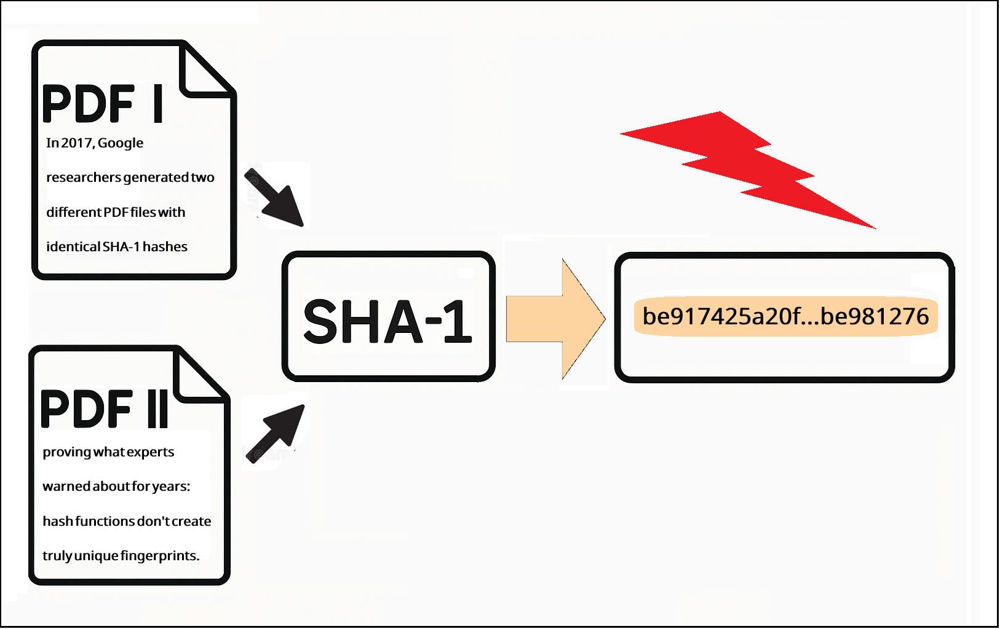
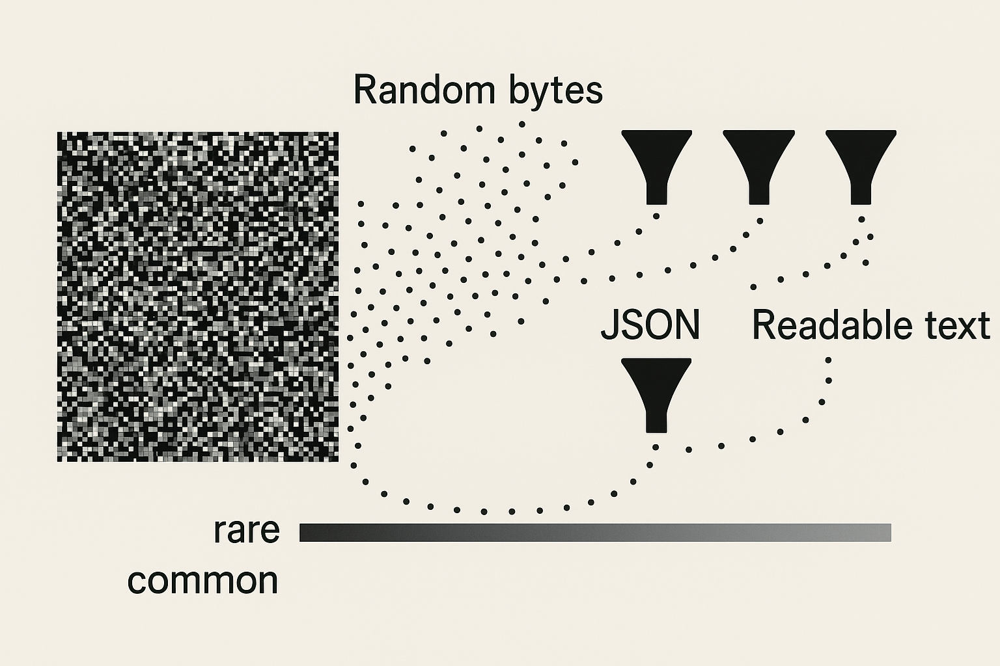
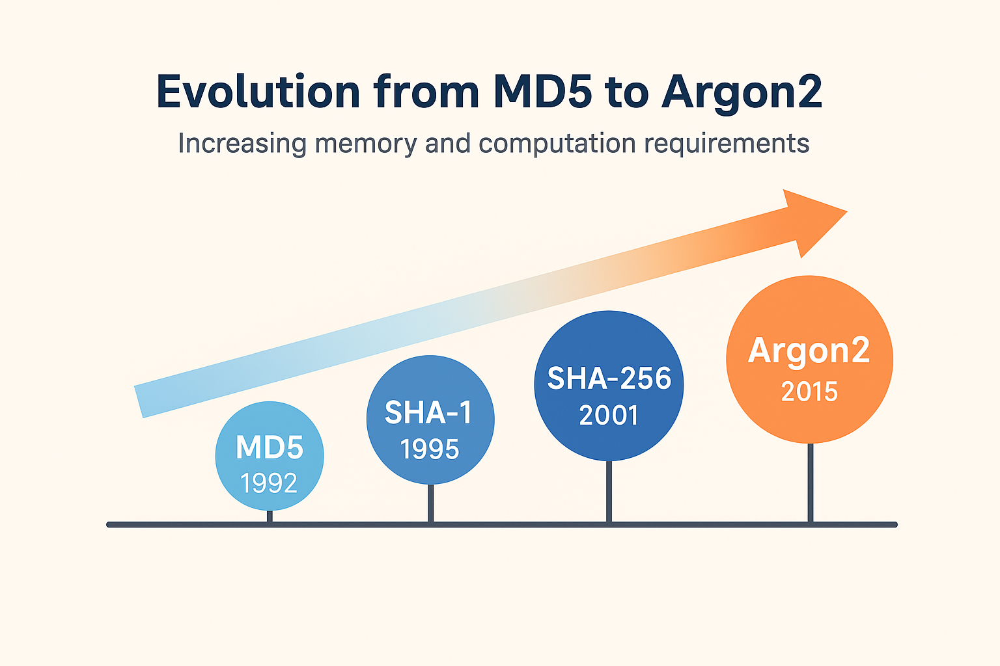

+++
title = "Hash Collisions: Why Your 'Unique' Fingerprints Aren't (And Why That's Usually OK)"
subtitle = "The mathematical certainty of collisions, the near-impossibility of meaningful ones, and what it means for modern cryptography"
date = "2025-11-17T06:00:00-07:00"
draft = false
categories = ["Essays and Perspectives"]
tags = ["blockchain", "cryptography", "hashing", "passwords", "security",]
author = "Tom Archer"
listThumb = "hash-collisions-thumb.png"
+++

<figure style="float: right; margin: 0 20px 10px 20px; width: 400px; text-align: center;">
  
  <figcaption style="font-size: 0.9em; color: #555; margin-top: 5px;">
    <em>In 2017, Google proved SHA-1 was broken by creating two different PDFs with identical hashes.</em>
  </figcaption>
</figure>

In 2017, Google researchers generated two different PDF files with identical SHA-1 hashes, finally proving what cryptographers had warned about for years: hash functions don't create truly unique fingerprints ([Stevens et al., 2017](#stevens2017)). This "SHAttered" attack required 9 quintillion SHA-1 computations, which is the equivalent to 6,500 years of single-CPU computation. The attack cost approximately $45,000 in cloud computing resources, making it accessible to well-funded adversaries but not casual attackers.

Yet despite this proof, we still trust hash functions for everything from Git commits to blockchain transactions to password storage. The reason is simple: while collisions are mathematically inevitable, meaningful collisions remain virtually impossible. The full story of hash collisions is more nuanced than "unique" versus "not unique."

---

>*"In cryptography, 'secure' has always meant 'secure for now'."*

---

<!--more-->

<div style="background-color: #f8f8f8; border-left: 4px solid #4CAF50; padding: 1em; margin: 1em 0;">
<strong>Historical Note:</strong> This post updates my 2005 article on hash collisions (<a href="#archer2005">Archer, 2005</a>). Back then, MD5 was still considered "acceptable with caveats" and adding salt to passwords seemed cutting-edge. It's fascinating (and somewhat alarming) to see which predictions came true and which assumptions had to be completely reconsidered.
</div>

Twenty years ago, I wrote about hash collisions when the biggest concern was spyware-removal applications getting false positives. Today, MD5 can be cracked on a laptop, simple salting is woefully inadequate, and billions of dollars in cryptocurrency depend on hash collision resistance. The landscape has shifted dramatically, with hash functions now underpinning everything from secure communications to digital currencies. But the fundamental questions remain: How unique are hash codes really? And when does it matter?

---

## The Pigeonhole Principle in Action

Hash algorithms generate fixed-length outputs regardless of input size. SHA-256 always produces 256 bits (32 bytes), whether you're hashing a single character or an entire library. SHA-3-512 always produces 512 bits. This creates an inherent mathematical constraint that's easy to visualize but hard to grasp in practice.

```python
import hashlib

# These vastly different inputs...
short_text = "Hi"
medium_text = "A" * 1000  # 1KB
long_text = "B" * 1_000_000  # 1MB

# ...all produce the same length output
print(len(hashlib.sha256(short_text.encode()).digest()))   # 32 bytes
print(len(hashlib.sha256(medium_text.encode()).digest()))  # 32 bytes  
print(len(hashlib.sha256(long_text.encode()).digest()))    # 32 bytes
```

The math is unforgiving: if you have \\(n\\) possible hash values, you only need \\(n + 1\\) distinct inputs to guarantee at least one collision. For SHA-256, that's \\(2^{256}\\) possible values; a number so large (roughly \\(10^{77}\\)) it exceeds the estimated number of atoms in the observable universe. Even with all the world's computing power working in parallel, finding a collision would take longer than the age of the universe.

But here's what most discussions miss: **not all collisions are created equal.** A collision between two random byte sequences is mathematically interesting but practically useless. A collision between two valid, meaningful documents is what actually threatens security.

---

## The Semantic Collision Problem

<figure style="float: right; margin: 0 20px 10px 20px; width: 400px; text-align: center;">
  
  <figcaption style="font-size: 0.9em; color: #555; margin-top: 5px;">
    <em>Random bytes almost never accidentally form meaningful structured data.</em>
  </figcaption>
</figure>

Finding two inputs that hash to the same value is one thing. Finding two *meaningful* inputs that hash to the same value is exponentially harder. Language, whether natural or programming, has structure and rules that random bytes almost never satisfy.

Consider trying to generate a collision for a classified document. Even if you could generate billions of documents with matching hash values, the probability of any making coherent sense, let alone containing plausible intelligence, approaches zero. The space of meaningful text is an infinitesimally small subset of all possible byte sequences.

```python
import random
import string
import json

def generate_random_bytes(length):
    """Generate random bytes that might hash to a target value."""
    return ''.join(random.choices(string.printable, k=length))

# Generate 1 million random attempts
attempts = [generate_random_bytes(100) for _ in range(1_000_000)]

# How many are valid JSON?
valid_json_count = 0
for attempt in attempts:
    try:
        json.loads(attempt)
        valid_json_count += 1
    except:
        pass

print(f"Valid JSON found: {valid_json_count}/1,000,000")  
# Output: Valid JSON found: 0/1,000,000

# How many are valid Python code?
valid_python_count = 0
meaningful_python_count = 0

for attempt in attempts:
    try:
        compile(attempt, '<string>', 'exec')
        valid_python_count += 1
        # Check if it contains meaningful constructs
        if any(keyword in attempt for keyword in 
               ['def ', 'class ', 'import ', 'for ', 'if ', 'while ']):
            meaningful_python_count += 1
    except:
        pass

print(f"Valid Python found: {valid_python_count}/1,000,000")
# Output: Valid Python found: ~6,000/1,000,000 (0.6%)

print(f"Meaningful Python found: {meaningful_python_count}/1,000,000")
# Output: Meaningful Python found: 0/1,000,000
```
While random bytes occasionally form valid Python (about 0.6% of the time), these are trivial statements like single digits or whitespace; not meaningful programs. None contain functions, classes, or control flow. Random bytes don't form valid JSON, and they certainly don't form functional code with semantic meaning.

This is why Git's reliance on SHA-1 (now SHA-256) remained practically secure despite theoretical vulnerabilities. Creating two *meaningful source code files* that compile, run correctly, perform useful operations, and contain malicious logic while matching an existing hash? That's not just hard; it's effectively impossible with current technology.

---

## What I Got Right and Wrong in 2005

### What I Got Right ✅

Let's start with the good news. It turns out I wasn't completely wrong about everything! Some of my 2005 predictions have aged surprisingly well, like a fine wine rather than milk left on the counter. These successes mostly came from focusing on fundamental principles rather than specific implementations.

- **Semantic collisions are nearly impossible** - Still true. Random data doesn't accidentally become meaningful. The structure of language and code remains our best defense against collision attacks.
- **Salt is essential for passwords** - Though what seemed "foolproof" then is now the bare minimum. The principle was correct, even if the implementation has evolved dramatically.
- **Hash algorithm strength matters** - I recommended SHA-256 for sensitive applications. Good call. It remains unbroken after nearly two decades.
- **Context determines security needs** - Hash tables vs. cryptographic uses require different guarantees. This distinction has only become more important as applications have diversified.

### What I Underestimated ❌

Now for the humbling part: the predictions that make me grateful the internet wasn't quite as permanent in 2005. If I'd known how wrong I'd be about computational power, I might have invested in NVIDIA stock instead of writing blog posts. These misses reveal just how badly we underestimate exponential growth.

- **GPU acceleration** - Modern GPUs test 10+ billion SHA-256 hashes/second, not the thousands I imagined. The parallel processing revolution transformed brute-force attacks from theoretical to practical.
- **Rainbow table sophistication** - They grew from gigabytes to terabytes, covering far more than "common passwords." Distributed computing and cheap storage made precomputation attacks far more powerful ([Oechslin, 2003](#oechslin2003)).
- **MD5's rapid demise** - I thought it had years left. It was fully broken within 12 months ([Wang & Yu, 2005](#wang2005)).
- **Blockchain's hash dependence** - Didn't see cryptocurrency coming, where hash collisions = economic catastrophe. An entire trillion-dollar economy now depends on hash collision resistance ([Nakamoto, 2008](#nakamoto2008)).

### What Changed Everything 🔄

And then there are the developments that nobody saw coming; the true black swans that redefined the entire landscape. These aren't failures of prediction so much as reminders that the future has a wicked sense of humor. Who could have predicted that digital coins would create a trillion-dollar economy entirely dependent on hash functions?

- **Cloud computing** - Renting 1000 GPUs for an hour costs less than my 2005 laptop. Computational power became a service, not a capital investment.
- **Cryptocurrency** - Created billion-dollar bounties for breaking hash functions. The economic incentives for attacks increased by orders of magnitude ([Nakamoto, 2008](#nakamoto2008)).
- **Quantum computing** - From science fiction to IBM offering quantum cloud access. Though still limited, quantum computers pose a genuine future threat to current hash functions ([Grover, 1996](#grover1996)).

---

## Real-World Collision Attacks

The transition from theoretical vulnerabilities to practical attacks has been swift and devastating for older hash functions. Each broken algorithm teaches us valuable lessons about cryptographic lifecycle and the importance of proactive migration. The attacks that seemed impossible in academic papers became downloadable tools within years.

### What's Broken

The cryptographic graveyard is littered with once-trusted algorithms that now serve as cautionary tales. These fallen giants remind us that "broken" in cryptography doesn't mean "slightly damaged"; it means completely, irreversibly compromised. Once an algorithm falls, there's no recovery, only migration to something stronger.

**MD5: Completely Compromised**

```python
# Don't do this anymore!
import hashlib

password = "user_password"
md5_hash = hashlib.md5(password.encode()).hexdigest()
print(f"MD5 (INSECURE): {md5_hash}")

# Collisions can be generated in seconds
# Real attack: 2008 rogue CA certificate using MD5 collisions
# Modern GPUs: ~25 billion MD5 hashes/second
# Status: NEVER use for anything security-critical
```

In 2008, researchers created a rogue CA certificate using MD5 collisions, allowing them to impersonate any website ([Sotirov et al., 2008](#sotirov2008)). The attack demonstrated that theoretical vulnerabilities inevitably become practical exploits. Today, you can generate MD5 collisions on a laptop in seconds using tools like HashClash ([Stevens, 2013](#stevens2013)). What once required a research team now fits in a GitHub repository.

**SHA-1: Officially Deprecated**

```python
import hashlib

# Also deprecated for security use
password = "user_password"
sha1_hash = hashlib.sha1(password.encode()).hexdigest()
print(f"SHA-1 (DEPRECATED): {sha1_hash}")

# SHAttered attack stats:
# - 9,223,372,036,854,775,808 SHA-1 computations
# - 6,500 CPU years (or 110 GPU years)
# - ~$45,000 in cloud computing costs (2020)
# Modern GPUs: ~15 billion SHA-1 hashes/second
```

The SHAttered attack marked a watershed moment in cryptographic history ([Stevens et al., 2017](#stevens2017)). While expensive, it proved that nation-states and well-funded criminal organizations could forge SHA-1 signatures. Major browsers and certificate authorities began emergency migrations away from SHA-1.

### What's Still Secure

After watching MD5 and SHA-1 fall, it's natural to wonder if any hash function can be trusted. The good news is that modern algorithms learned from their predecessors' failures, incorporating defenses against known attack vectors while maintaining practical performance. These functions represent the current state of the art, though history teaches us to remain vigilant.

```python
import hashlib

# Modern, secure hash functions
password = "user_password"
sha256_hash = hashlib.sha256(password.encode()).hexdigest()
sha3_hash = hashlib.sha3_256(password.encode()).hexdigest()

print(f"SHA-256 (SECURE): {sha256_hash}")
print(f"SHA-3 (SECURE): {sha3_hash}")

# Also consider BLAKE2 for performance
import hashlib
blake2_hash = hashlib.blake2b(password.encode()).hexdigest()
print(f"BLAKE2b (SECURE & FAST): {blake2_hash}")
```

Modern hash functions incorporate lessons from past failures. SHA-256 uses a more complex structure that resists known attack patterns. SHA-3 employs an entirely different design philosophy (sponge construction) to avoid SHA-2's potential weaknesses ([Bertoni et al., 2013](#bertoni2013)). BLAKE2 optimizes for speed while maintaining security, making it ideal for high-throughput applications ([Aumasson et al., 2013](#aumasson2013)).

**Current Status:**
- **SHA-256/SHA-3**: No practical collision attacks known. The energy required to find a collision exceeds the annual output of the sun.
- **BLAKE2/BLAKE3**: Modern alternatives, faster than SHA-256. Designed with modern CPU architectures in mind.
- **Energy requirement for SHA-256 collision**: More than the sun outputs in a year. This isn't hyperbole; it's thermodynamic reality.

---

## Modern Password Hashing: Beyond Salt

<figure style="float: right; margin: 0 20px 10px 20px; width: 400px; text-align: center;">
  
  <figcaption style="font-size: 0.9em; color: #555; margin-top: 5px;">
    <em>Password hashing has evolved from simple hashes to memory-hard, time-expensive algorithms.</em>
  </figcaption>
</figure>

Twenty years ago, I wrote that adding salt to passwords before hashing would produce "an almost fool-proof system" ([Archer, 2005](#archer2005)). That confidence seems quaint now. Today, simple salting is the absolute minimum, and often insufficient. The arms race between defenders and attackers has driven innovation in password hashing far beyond what we imagined possible.

### The Evolution: Then vs. Now

The transformation in password hashing over the past two decades represents one of the most dramatic shifts in applied cryptography. 
What seemed like robust protection in 2005 now looks dangerously naive. 
The evolution wasn't just incremental improvements; it was a complete rethinking of how we protect passwords from both mathematical and practical attacks. 
The code samples below illustrate this stark contrast between old and modern approaches.

<div style="display: flex; gap: 20px; margin: 20px 0;">
<div style="flex: 1; background: #fff3f3; padding: 15px; border-radius: 5px;">
<h4>Then (2005)</h4>

```python
import hashlib
import os

# Old way (DON'T DO THIS)
password = "user_password"
salt = os.urandom(16)
old_hash = hashlib.sha1(
    password.encode() + salt
).hexdigest()

print(f"Password: {password}")
print(f"Salt (hex): {salt.hex()}")
print(f"SHA-1 Hash: {old_hash}")

# Example output:
# Password: user_password
# Salt (hex): 4f3a2b1c8d9e5f...
# SHA-1 Hash: 8b4066b178c928...
# Seemed secure at the time!

```
</div>

<div style="flex: 1; background: #f3fff3; padding: 15px; border-radius: 5px;">
<h4>Now (2025)</h4>

```python
# pip install argon2-cffi
import argon2

# Modern way with Argon2
hasher = argon2.PasswordHasher(
    memory_cost=65536,  # 64 MB
    time_cost=3,        # iterations  
    parallelism=4,      # threads
)

password = "user_password"
password_hash = hasher.hash(password)

print(f"Password: {password}")
print(f"Argon2 Hash: {password_hash}")

# Example output:
# Password: user_password
# Argon2 Hash: $argon2id$v=...
```
</div>
</div>

The evolution from simple salted hashes to memory-hard functions represents a fundamental shift in defensive strategy. 
We've moved from trying to hide the algorithm to making it computationally expensive even when fully known. Modern password hashing embraces transparency while ensuring that brute force remains impractical.

### Why Simple Hashing Failed

Rainbow tables (precomputed hash databases) destroyed simple hash-based password storage. These massive databases, some exceeding 100TB, could reverse common password hashes instantly ([Oechslin, 2003](#oechslin2003)). What seemed like strong protection crumbled when attackers could simply look up the answer.

```python
import hashlib

# Demonstrating why unsalted hashes are vulnerable
common_passwords = ["password", "123456", "password123", "admin"]
rainbow_table = {}

# Attacker precomputes common password hashes
for pwd in common_passwords:
    rainbow_table[hashlib.sha256(pwd.encode()).hexdigest()] = pwd

# Now they can instantly reverse any matching hash
target_hash = hashlib.sha256("password".encode()).hexdigest()
if target_hash in rainbow_table:
    print(f"Password found: {rainbow_table[target_hash]}")
    # Output: Password found: password
```

Modern GPUs can test billions of SHA-256 hashes per second, making even salted SHA-256 vulnerable to brute force. A single RTX 4090 can test 15 billion passwords per second. Argon2, winner of the 2015 Password Hashing Competition, requires substantial memory for each guess, neutralizing the GPU advantage ([Biryukov et al., 2016](#biryukov2016)). By requiring 64MB of RAM per attempt, it forces attackers to choose between speed and parallelism.

```python
import time
import hashlib
import argon2

password = "test_password"

# Time SHA-256 (fast - bad for passwords)
start = time.time()
for _ in range(10000):
    hashlib.sha256(password.encode()).hexdigest()
sha_time = time.time() - start

# Time Argon2 (slow by design - good for passwords)
hasher = argon2.PasswordHasher()
start = time.time()
for _ in range(10):  # Only 10 iterations!
    hasher.hash(password)
argon_time = time.time() - start

print(f"SHA-256 (10,000 hashes): {sha_time:.2f} seconds")
print(f"Argon2 (10 hashes): {argon_time:.2f} seconds")
# SHA-256 is ~10,000x faster - that's the point!
```

### Alternative Modern Algorithms

While Argon2 is the gold standard, other algorithms serve specific needs. Each represents a different approach to the same problem: making brute force attacks economically infeasible. The diversity of approaches provides defense in depth.

```python
import os
password = 'user_password'

# bcrypt - Battle-tested, widely supported
import bcrypt
bcrypt_hash = bcrypt.hashpw(password.encode(), bcrypt.gensalt(rounds=12))
print(f"bcrypt (60 chars):  {bcrypt_hash.decode()}")
# Output: $2b$12$Qw5xgFn8RO7yK3H9Lz5Pzu0GlGXoJe7bVkT9XwRnL3kI8yB5x2G7m

# scrypt - Memory-hard, used by some cryptocurrencies
import hashlib
salt = os.urandom(16)
scrypt_hash = hashlib.scrypt(
    password.encode(),
    salt=salt,
    n=16384, r=8, p=1
)
print(f"scrypt (64 bytes):  {scrypt_hash.hex()[:60]}...")
# Output: a7c3f2e8b9d4a1c6e9f3b8d2c7a4e9f1b3d8c2a7e4f9b1c3d8a2e7f4b9c1...

# PBKDF2 - NIST approved, works everywhere
salt = os.urandom(16)
pbkdf2_hash = hashlib.pbkdf2_hmac(
    'sha256',
    password.encode(),
    salt=salt,
    iterations=100000
)
print(f"PBKDF2 (32 bytes):  {pbkdf2_hash.hex()[:60]}...")
# Output: 5f4dcc3b5aa765d61d8327deb882cf99e8f3a1b2c4d5e6f7a8b9c0d1e2f3a4b5...

# Note the different output formats:
# - bcrypt: includes algorithm, cost, salt, and hash in one string
# - scrypt/PBKDF2: raw bytes, need separate salt storage

```

Each algorithm makes different tradeoffs between security, performance, and compatibility. bcrypt remains popular due to its maturity and wide support ([Provos & Mazières, 1999](#provos1999)). scrypt's memory requirements made it attractive for cryptocurrency mining ([Percival, 2009](#percival2009)). PBKDF2 offers the broadest compatibility, working even in constrained environments ([Kaliski, 2000](#kaliski2000)).

---

## Blockchain and Hash Collisions

Cryptocurrencies bet billions on hash collision resistance. The entire security model of blockchain depends on the infeasibility of finding hash collisions. Bitcoin's approach is particularly paranoid, using double hashing to protect against potential weaknesses ([Nakamoto, 2008](#nakamoto2008)).

```python
import hashlib

def bitcoin_hash(data):
    """Bitcoin uses double SHA-256 for extra security."""
    first_hash = hashlib.sha256(data.encode()).digest()
    second_hash = hashlib.sha256(first_hash).digest()
    return second_hash.hex()

# Example Bitcoin block header hashing
block_header = "version|prev_block|merkle_root|timestamp|bits|nonce"
block_hash = bitcoin_hash(block_header)
print(f"Bitcoin block hash: {block_hash}")
```

If SHA-256 falls, the implications are staggering and immediate. Transaction history could be rewritten, allowing double-spending and theft. Digital signatures could be forged, compromising wallet security. Proof-of-work becomes meaningless, destroying the consensus mechanism. Billions in value would evaporate overnight.

This is why Ethereum is already planning post-quantum cryptography migrations. The threat may be years away, but the stakes are too high to wait. NIST's Post-Quantum Cryptography competition selected four algorithms in 2022, with implementation beginning across critical infrastructure ([NIST, 2022](#nist2022)):

```python
import hashlib

# Simulating crypto-agility in smart contracts
class HashAlgorithm:
    SHA256 = 1
    SHA3_256 = 2
    BLAKE3 = 3
    CRYSTALS_DILITHIUM = 4  # Post-quantum signature
    SPHINCS_PLUS = 5  # Stateless post-quantum

class FutureProofContract:
    def __init__(self):
        self.hash_version = HashAlgorithm.SHA256
    
    def hash_data(self, data):
        if self.hash_version == HashAlgorithm.SHA256:
            return hashlib.sha256(data.encode()).hexdigest()
        elif self.hash_version == HashAlgorithm.SHA3_256:
            return hashlib.sha3_256(data.encode()).hexdigest()
        # Ready to upgrade when quantum computers arrive
    
    def upgrade_hash_algorithm(self, new_version):
        """Allows migration to stronger algorithms."""
        self.hash_version = new_version

# Usage example
contract = FutureProofContract()
data = "Critical transaction data"

# Initial state: SHA-256
hash1 = contract.hash_data(data)
print(f"SHA-256:   {hash1}")
# Output: SHA-256:   8b5e9db8c4f9a7e3b1d2c3f4a5b6c7d8e9f0a1b2c3d4e5f6a7b8c9d0e1f2a3b4

# Upgrade to SHA3-256 (perhaps due to SHA-256 weakness discovered)
contract.upgrade_hash_algorithm(HashAlgorithm.SHA3_256)
hash2 = contract.hash_data(data)
print(f"SHA3-256:  {hash2}")
# Output: SHA3-256:  f4a1b2c3d4e5f6a7b8c9d0e1f2a3b4c5d6e7f8a9b0c1d2e3f4a5b6c7d8e9f0a1

# Both algorithms can coexist - old data verified with SHA-256, new with SHA3-256
print("\nKey insight: Same data, different algorithms, different hashes")
print("Old transactions remain valid with their original algorithm")
```

---

## When Collisions Don't Matter

Not every use of hashing requires collision resistance. Many applications use hashing for efficiency rather than security. In these cases, occasional collisions are acceptable or even expected. Understanding the difference is crucial for choosing the right tool.

```python
# Document dirty checking - collision would just trigger unnecessary save

import hashlib

class DocumentEditor:
    def __init__(self, content):
        self.content = content
        self.saved_hash = hashlib.sha256(content.encode()).hexdigest()
    
    def is_dirty(self):
        current_hash = hashlib.sha256(self.content.encode()).hexdigest()
        return current_hash != self.saved_hash
    
    def save(self):
        # Save document to disk
        self.saved_hash = hashlib.sha256(self.content.encode()).hexdigest()
        return "Document saved"

# Usage
editor = DocumentEditor("Initial content")
print(editor.is_dirty())  # False

editor.content = "Modified content"
print(editor.is_dirty())  # True - triggers save prompt

editor.save()
print(editor.is_dirty())  # False again
```

```python
# Hash table - collisions are expected and handled
class SimpleHashTable:
    # ... existing code ...
```

**Use cases where collisions are acceptable:**
- **Document dirty checking**: Collision would just trigger an unnecessary save prompt. No data loss, just minor inconvenience.
- **Hash tables/dictionaries (handled via chaining):** Collisions just create linked lists at each bucket. Performance degrades gracefully.
- **Cache keys (collision = cache miss, not security breach)**: Worst case is fetching from the source again. No security impact.
- **Load balancing (collision = slightly uneven distribution)**: Some servers get more traffic, but the system continues functioning.
- **Data deduplication (extremely rare collision = minor storage inefficiency)**: You might store a duplicate, wasting space but not corrupting data.

---

## Best Practices for 2025

Choosing the right hashing approach depends entirely on your use case. Security-critical applications require different algorithms than performance-critical ones. The key is understanding the tradeoffs and selecting appropriately.

### 1. Choose the Right Tool

Different hashing use cases demand fundamentally different approaches. Using SHA-256 for password storage is like using a race car for off-roading; it's the wrong tool for the terrain. Understanding which algorithm fits which purpose can mean the difference between a secure system and a compromised one.

```python
import hashlib
import argon2
import hmac

# File integrity (collision resistance matters)
def file_checksum(filepath):
    sha256_hash = hashlib.sha256()
    with open(filepath, "rb") as f:
        for chunk in iter(lambda: f.read(4096), b""):
            sha256_hash.update(chunk)
    return sha256_hash.hexdigest()

# Password storage (use specialized algorithm)
def hash_password(password):
    return argon2.PasswordHasher().hash(password)

# Message authentication (use HMAC)
def create_mac(message, secret_key):
    return hmac.new(
        secret_key.encode(),
        message.encode(),
        hashlib.sha256
    ).hexdigest()

# Content addressing (collision resistance critical)
def content_address(data):
    return hashlib.sha3_256(data.encode()).hexdigest()
```

Each function serves a specific purpose with appropriate security guarantees. File checksums need collision resistance but not slowness. Passwords need slowness but benefit from specialized algorithms. Message authentication needs a secret key. Content addressing needs strong collision resistance for integrity.

### 2. Plan for Crypto-Agility

The graveyard of broken hash functions teaches us one crucial lesson: no algorithm is forever. Systems built today must anticipate the cryptographic breaks of tomorrow. Crypto-agility, the ability to seamlessly migrate to new algorithms, transforms a future crisis into a routine upgrade.

```python
import json
from enum import Enum

class HashVersion(Enum):
    SHA256_V1 = "sha256_v1"
    SHA3_256_V2 = "sha3_256_v2"
    BLAKE3_V3 = "blake3_v3"

class VersionedHasher:
    def __init__(self):
        self.current_version = HashVersion.SHA3_256_V2
        
    def hash_with_version(self, data):
        """Store algorithm version with hash."""
        if self.current_version == HashVersion.SHA256_V1:
            hash_value = hashlib.sha256(data.encode()).hexdigest()
        elif self.current_version == HashVersion.SHA3_256_V2:
            hash_value = hashlib.sha3_256(data.encode()).hexdigest()
        
        return {
            "version": self.current_version.value,
            "hash": hash_value
        }
    
    def verify(self, data, versioned_hash):
        """Verify using the original algorithm."""
        version = HashVersion(versioned_hash["version"])
        
        if version == HashVersion.SHA256_V1:
            computed = hashlib.sha256(data.encode()).hexdigest()
        elif version == HashVersion.SHA3_256_V2:
            computed = hashlib.sha3_256(data.encode()).hexdigest()
        
        return computed == versioned_hash["hash"]

# Usage
hasher = VersionedHasher()
stored_hash = hasher.hash_with_version("important data")
print(json.dumps(stored_hash, indent=2))
```

Storing the algorithm version with each hash enables graceful migration. When SHA-256 eventually falls, systems can upgrade without invalidating existing hashes. This approach has proven essential for long-lived systems that have already survived multiple algorithm transitions.

### 3. Security Checklist

Twenty years of watching hash functions fall has produced clear patterns about what to avoid and what to embrace. This checklist distills those hard-won lessons into actionable guidance. Following these guidelines won't make your system unbreakable, but it will ensure you're not making mistakes we should have learned from by now.

**Never use for security:**
- ❌ MD5 (broken since 2004) - Collisions can be generated in seconds. Only use for non-security checksums.
- ❌ SHA-1 (broken since 2017) - Practical collisions demonstrated. Major browsers reject SHA-1 certificates.
- ❌ Plain SHA-256 for passwords (too fast) - Billions of attempts per second on modern GPUs. Use memory-hard functions instead.

**Current best practices:**
- ✅ SHA-256/SHA-3 for file integrity - Strong collision resistance with good performance.
- ✅ Argon2id for password storage - Memory-hard, time-expensive, and resistant to side-channel attacks.
- ✅ BLAKE3 for performance-critical hashing - Faster than MD5 while being cryptographically secure.
- ✅ HMAC for message authentication - Provides authentication and integrity with a secret key.
- ✅ Store algorithm version with hashes - Enables future migrations without breaking existing data.
- ✅ bcrypt/scrypt as Argon2 alternatives - Mature alternatives when Argon2 isn't available.

---

## Closing Thoughts

Hash functions don't produce unique values. They produce values so astronomically unlikely to collide that we can pretend they're unique. For SHA-256, finding a collision would require more computational power than humanity will likely ever possess. But as history has shown, "unfeasibly difficult" is not "impossible."

The history of cryptography is littered with "unbreakable" systems that fell to advancing mathematics and computing power. MD5 went from secure to broken in 13 years. SHA-1 lasted 22 years. How long will SHA-256 survive? Quantum computers may accelerate this timeline dramatically, though current quantum computers are still far from threatening SHA-256 ([Grover, 1996](#grover1996)).

The lesson isn't to panic about hash collisions. It's to design systems that can evolve. Store your algorithm versions. Plan your migration paths. Understand when collision resistance matters and when it doesn't. Build with the assumption that any algorithm will eventually fall.

Twenty years from now, someone might be updating this post again, explaining why SHA-256 is broken and why we should have seen it coming. The fundamentals won't change. Finite outputs for infinite inputs guarantee collisions. But hopefully, we'll have learned to build systems that gracefully handle the inevitable transition to whatever comes next.

*See you in 2045 when we're explaining why SHA-256 wasn't quantum-resistant and how we should have known all along.*

---

## Try It Yourself

[Download the enhanced code samples on GitHub](https://github.com/TomArcher/technical-blog-examples/tree/main/hash-collisions)

<div style="background-color: #f8f8f8; border-left: 4px solid #4CAF50; padding: 1em; margin: 1em 0;">
<strong>Enhanced Code Samples Available!</strong> The repository includes runnable versions with timing comparisons, detailed output, and additional examples that demonstrate each concept in action. Each script can be run independently and includes explanatory output to reinforce the concepts from this post.
</div>

---

## Further Reading

These resources provide historical perspectives, deeper technical details, and current best practices for those who want to explore further. The [SHAttered website](#stevens2017) includes the actual PDFs that collide, allowing you to verify the attack yourself. The OWASP guide is regularly updated as new threats emerge.

<a id="archer2005"></a>
- Archer, T. (2005). [Are Hash Codes Unique?](https://learn.microsoft.com/en-us/archive/blogs/tomarcher/are-hash-codes-unique). *Microsoft Developer Blogs*.  
  *My original 2005 post on hash collisions, preserved for historical perspective.*

<a id="aumasson2013"></a>
- Aumasson, J. P., Neves, S., Wilcox-O'Hearn, Z., & Winnerlein, C. (2013). [BLAKE2: Simpler, smaller, fast as MD5](https://blake2.net/blake2.pdf). *Proceedings of ACNS 2013*.  
  *Introduces BLAKE2, showing how modern hash functions can be both fast and secure.*

<a id="bertoni2013"></a>
- Bertoni, G., Daemen, J., Peeters, M., & Van Assche, G. (2013). [Keccak](https://keccak.team/files/Keccak-reference-3.0.pdf). *SHA-3 Competition Winner*.  
  *The SHA-3 specification, introducing the sponge construction that differs fundamentally from SHA-2.*

<a id="biryukov2016"></a>
- Biryukov, A., Dinu, D., & Khovratovich, D. (2016). [Argon2: New generation of memory-hard functions for password hashing and other applications](https://www.password-hashing.net/argon2-specs.pdf). *Password Hashing Competition Winner*.  
  *The winning algorithm of the Password Hashing Competition, now the gold standard for password storage.*

<a id="grover1996"></a>
- Grover, L. K. (1996). [A fast quantum mechanical algorithm for database search](https://arxiv.org/abs/quant-ph/9605043). *Proceedings of STOC 1996*.  
  *The foundational quantum algorithm that reduces hash function security from 2^n to 2^(n/2).*

<a id="kaliski2000"></a>
- Kaliski, B. (2000). [PKCS #5: Password-Based Cryptography Specification Version 2.0](https://www.rfc-editor.org/rfc/rfc2898). *RFC 2898*.  
  *Defines PBKDF2, still widely used for password hashing in constrained environments.*

<a id="nakamoto2008"></a>
- Nakamoto, S. (2008). [Bitcoin: A Peer-to-Peer Electronic Cash System](https://bitcoin.org/bitcoin.pdf).  
  *The Bitcoin whitepaper, showing how hash functions became the foundation of a trillion-dollar economy.*

<a id="nist2022"></a>
- NIST. (2022). [NIST Announces First Four Quantum-Resistant Cryptographic Algorithms](https://www.nist.gov/news-events/news/2022/07/nist-announces-first-four-quantum-resistant-cryptographic-algorithms).  
  *The selected post-quantum algorithms that will replace current standards.*

<a id="oechslin2003"></a>
- Oechslin, P. (2003). [Making a faster cryptanalytic time-memory trade-off](https://lasec.epfl.ch/pub/lasec/doc/Oech03.pdf). *Proceedings of CRYPTO 2003*.  
  *Introduces rainbow tables, the attack that made simple password hashing obsolete.*

<a id="percival2009"></a>
- Percival, C. (2009). [Stronger key derivation via sequential memory-hard functions](https://www.tarsnap.com/scrypt/scrypt.pdf).  
  *The scrypt paper, pioneering memory-hard functions for password hashing.*

<a id="provos1999"></a>
- Provos, N., & Mazières, D. (1999). [A future-adaptable password scheme](https://www.usenix.org/legacy/events/usenix99/provos/provos.pdf). *Proceedings of USENIX 1999*.  
  *Introduces bcrypt, which remained secure for over 20 years through adaptive cost parameters.*

<a id="sotirov2008"></a>
- Sotirov, A., Stevens, M., Appelbaum, J., Lenstra, A., Molnar, D., Osvik, D. A., & de Weger, B. (2008). [MD5 considered harmful today: Creating a rogue CA certificate](https://www.win.tue.nl/hashclash/rogue-ca/).  
  *The practical attack that definitively killed MD5 for security applications.*

<a id="stevens2013"></a>
- Stevens, M. (2013). [New collision attacks on SHA-1 based on optimal joint local-collision analysis](https://marc-stevens.nl/research/papers/EC13-S.pdf). *Proceedings of EUROCRYPT 2013*.  
  *Theoretical foundation for the SHAttered attack that would come four years later.*

<a id="stevens2017"></a>
- Stevens, M., Bursztein, E., Karpman, P., Albertini, A., & Markov, Y. (2017). [The first collision for full SHA-1](https://shattered.io/static/shattered.pdf). *Proceedings of CRYPTO 2017*.  
  *The SHAttered attack paper that proved SHA-1 was practically broken.*

<a id="wang2005"></a>
- Wang, X., & Yu, H. (2005). [How to break MD5 and other hash functions](https://merlot.usc.edu/csac-f06/papers/Wang05a.pdf). *Proceedings of EUROCRYPT 2005*.  
  *The breakthrough that showed MD5 collisions could be found in hours, not centuries.*

---
