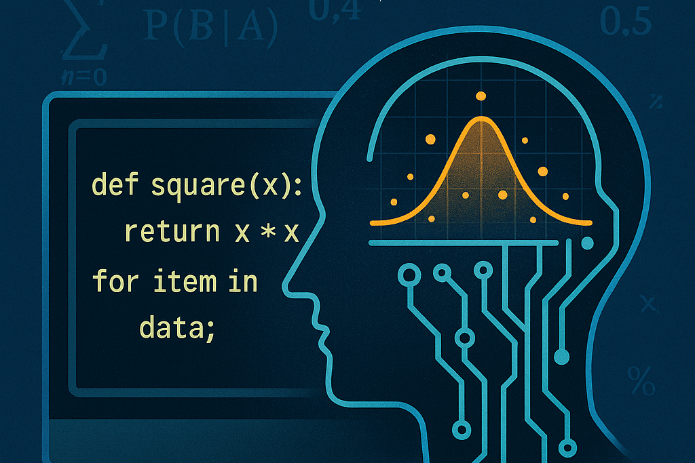
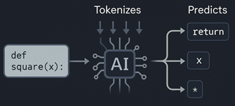

+++
date = '2025-10-06T09:00:00-07:00'
draft = false
title = "How AI Reads Code: What Large Language Models Actually Understand"
subtitle = "Exploring how large language models interpret code and what they miss"
categories = ["Academic", "Generative AI"]
tags = [
    "AI Interpretation", 
    "Code Semantics",
    "Large Language Models", 
]
author = "Tom Archer"
listThumb = "how-ai-reads-code.png"
+++

<figure style="float: right; margin: 0 20px 10px 20px; width: 250px; text-align: center;">
    
    <figcaption style="font-size: 0.9em; color: #555; margin-top: 5px;">
        <em>AI reads code as patterns, not instructions.</em>
    </figcaption>
</figure>

Developers are accustomed to thinking about code in terms of syntax and semantics, the how and the why. Syntax defines what is legal; semantics defines what it means. A compiler enforces syntax with ruthless precision and interprets semantics through symbol tables and execution logic. But a large language model, or LLM, reads code the way a seasoned engineer reads poetry, recognizing rhythm, pattern, and context more than explicit rules. 

---

> *"When an AI system 'understands' code, it is not executing logic; it is modeling probability.*"

---

<!--more-->

The difference may seem subtle, but it has vast consequences. Understanding the gap between human reasoning, compiler verification, and model prediction is key to using generative AI responsibly in programming environments.

---

### What Is an LLM (Large Language Model)?

If you're new to the world of generative AI, it helps to start with a clear idea of what a large language model actually is. An LLM is an AI system trained on vast collections of text to recognize and reproduce the patterns of human language. It doesn't just store sentences; it learns relationships between words, ideas, and structures.

These models can do many things:

* Answer questions
* Write content
* Translate languages
* Summarize text
* Hold conversations
* Generate code

**Examples:** [ChatGPT (OpenAI)](https://chatgpt.com/), [Claude (Anthropic)](https://claude.ai/new), [Gemini (Google)](https://gemini.google.com/app), and [LLaMA (Meta)](https://www.llama.com/).

The "large" in large language model refers to the scale of parameters where billions of adjustable values tune how the model interprets and generates text.

At its core, an LLM is a probability engine. It predicts the next most likely word or token based on the context of what came before. That simple act, repeated across billions of examples during training, is what gives these models the ability to sound fluent, coherent, and contextually aware.

In other words, an LLM doesn't think about language; it **models** language itself.

---

### Syntax as Pattern, Not Rule

When a compiler reads a function like the following, it parses tokens, constructs an abstract syntax tree (AST), and transforms the result into intermediate bytecode. The semantics are precise: multiply the variable `x` by itself.

```python
def square(x): 
    return x * x
```

<figure style="float: right; margin: 0 20px 10px 20px; width: 250px; text-align: center;">
    
    <figcaption style="font-size: 0.9em; color: #555; margin-top: 5px;">
        <em>Patterns drive AI recognition; not syntax.</em>
    </figcaption>
</figure>

An LLM, by contrast, does not parse in the traditional sense. It tokenizes, compressing text by subword frequency rather than grammatical role, and then predicts one token at a time based on the statistical context of all previous tokens. The model "understands" that `return x * x` likely follows `def square(x):` because it has seen this pattern thousands of times across training corpora, not because it knows what multiplication does.

In the language of probability, a compiler computes meaning deterministically; a model approximates it stochastically.

---

### The Shape of Understanding

When a human reads code, we chunk it semantically. The line `for user in data:` evokes an internal schema: iteration, collection, filtering. The model does something analogous, but its mental map is geometric, not symbolic.

Consider the following prompt given to a model fine-tuned on code:

```
"def process_users(data):"
```

This becomes a dense vector in a high-dimensional embedding space. Nearby vectors might represent similar constructs like "process_orders(data)" or "handle_clients(list)."

These proximity relationships are the raw materials of AI understanding. The closer two snippets lie in vector space, the more the model perceives them as semantically related, even when the model has no explicit representation of what a user or an order is.

Embeddings compress the vast space of human logic into geometric analogies. Code with similar structure, naming, and flow tends to cluster, which is why renaming a variable or removing a comment can subtly shift a model's interpretation.

---

### The Comment Paradox

To illustrate, try this small experiment using the OpenAI API:

```python
import openai

response = openai.ChatCompletion.create(
    model="gpt-4o-mini",
    messages=[
        {
            "role": "user",
            "content": (
                "Explain what this function does:\n\n"
                "# Send a welcome email to all active users\n"
                "def process_users(data):\n"
                "    for user in data:\n"
                "        if user.is_active:\n"
                "            send_email(user)"
            ),
        }
    ],
    logprobs=True,
)
```

The model will usually reply that the function "sends a welcome email to all active users." Now remove the comment and run it again. The response will still be similar, but the probability distribution shifts: the model's confidence in "welcome email" drops because the lexical hint vanished.

Comments not only help humans; they also anchor semantic space for models. Embeddings are sensitive to natural language cues because language and code share the same token vocabulary. That is why consistent commenting style, clear naming, and logical spacing often yield more accurate AI-assisted explanations and refactorings.

---

### When Syntax Misleads Semantics

Because models learn from co-occurrence rather than execution, they sometimes hallucinate logic. A variable named `result` near `sum()` nudges the model to assume aggregation, even if the code computes a difference. The model's "understanding" is weighted toward linguistic bias.

Take this example:

```python
def calculate_difference(a, b):
    result = a + b
    return result
```

A human instantly spots the contradiction between the name and operation. A compiler does not care. An LLM, however, may explain this as "subtracts one number from another," proving that its semantic space privileges pattern frequency over operational truth.

Studies on code-focused transformers have shown that inconsistent or misleading identifiers measurably reduce prediction confidence, often by 15 to 25 percent, when evaluated through log-probability sampling. These results confirm that models internalize identifier semantics and exhibit instability when naming contradicts function.

---

### The Statistical Mind

LLMs do not parse control flow; they predict control flow. When you type `for`, the model's top token candidates include `i`, `item`, and `user`. When it predicts `if user.is_active:`, it has learned a latent schema: "loop + conditional + method call" often ends in a side effect like `send_email(user)` or `update_status(user)`.

That is not understanding in the compiler sense; it is associative modeling. But this statistical machinery is astonishingly effective because code follows social, not natural, evolution. Developers imitate idioms. AI imitates our imitation. Together, they form a feedback loop of probabilistic convention.

---

### From Tokens to Intent

To see how deep this patterning goes, look at a model's log probabilities for a simple prompt:

```
"def is_palindrome(s): return s == s[::-1]"
```

The log probability for `s[::-1]` is extremely high because that slice notation is a canonical pattern in the training corpus for palindrome detection. (For a deeper look at what *log probability* means and why models use it, see [Inside the Mind of a Model: How AI Turns Meaning into Math](/posts/how-ai-turns-meaning-into-math/).)

Now, consider a less common variant of the same prompt:

```
"def is_palindrome(s): return s == ''.join(reversed(s))"
```

Here, the probability distribution shifts. Both are correct, but one feels "unnatural" to the model. AI reads code with a memory of popularity, not authority.

---

### The Compiler and the Poet

A compiler knows exactly what your code does and cares nothing about what you meant. A language model knows approximately what you meant and nothing about what your code does.

The compiler enforces the syntax of logic; the model enforces the logic of culture. The former transforms instructions into machine behavior. The latter transforms text into probabilities that resemble meaning. When these systems meet, such as in Copilot or GitHub's autocomplete, they complement each other beautifully. The compiler guarantees execution; the model suggests intention.

---

### The Power of Context Windows

One of the most underappreciated aspects of AI code comprehension is the size of its context window. The broader the context, the closer a model gets to true comprehension.

In human terms, a developer reading fifty lines can recall relationships across functions; a model with a 128k token window can recall dependencies across entire modules. This does not facilitate logical reasoning, but it does enable global pattern retention, which is crucial for tasks such as refactoring, summarization, or maintaining style consistency.

---

### Experimenting with Prompt Geometry

Developers can exploit the geometric nature of embeddings by rephrasing code-related prompts. For example, rather than asking:

> "Explain this code."

ask:

> "What would this function's docstring likely say in a production environment?"

That subtle shift pushes the model's attention toward documentation-style patterns in embedding space, yielding more reliable summaries. Understanding this geometric reasoning, how nearby textual forms affect token probabilities, is becoming an essential literacy for AI-assisted programming.

---

### When Probabilities Meet Production

Models that read code can accelerate onboarding, documentation, and even code review, but they introduce risk if developers mistake probability for proof. A suggestion may be statistically likely but logically wrong.

In safety-critical domains such as finance, medicine, and infrastructure, LLMs should never operate without a deterministic verification layer. Tools that combine static analysis with generative suggestions, such as semantic linting or differential testing, provide a bridge between the stochastic intuition of AI and the formal rigor of compilers.

---

### Toward a Hybrid Intelligence

The real frontier lies in coupling deterministic parsers with probabilistic interpreters. Imagine an IDE where the compiler exposes ASTs and an LLM attaches commentary to each node, explaining likely intent, flagging anomalies, and predicting downstream effects.

Such systems would merge two epistemologies: the compiler's precision and the model's pattern sense. Humans would no longer alternate between "write mode" and "read mode" but collaborate with an entity capable of probabilistic empathy for code.

---

## Final Thoughts

After many years of writing software, I have come to realize that code is as cultural as it is logical. Every function carries fingerprints of habits, mentors, and languages long gone. Large language models do not understand code the way we do; they remember it, in the collective statistical sense. They compress decades of programming idioms into geometry.

That is why an AI sometimes finishes your thought before you finish typing. It is not reading your mind; it is reading the echoes of every mind that came before you.

And that, in its strange, approximate way, is a kind of understanding.

---

If you'd like to see how these ideas translate into math and geometry, continue with [Inside the Mind of a Model: How AI Turns Meaning into Math](/posts/how-ai-turns-meaning-into-math/).

---