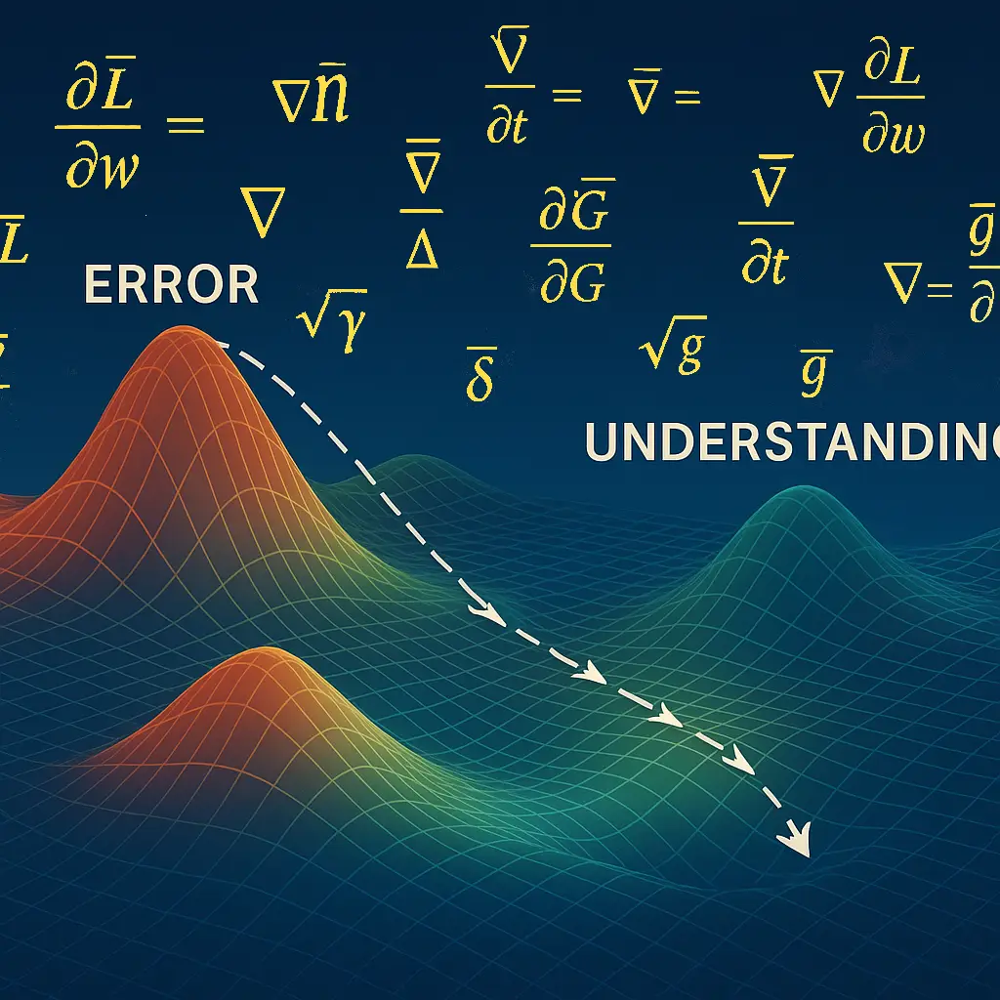
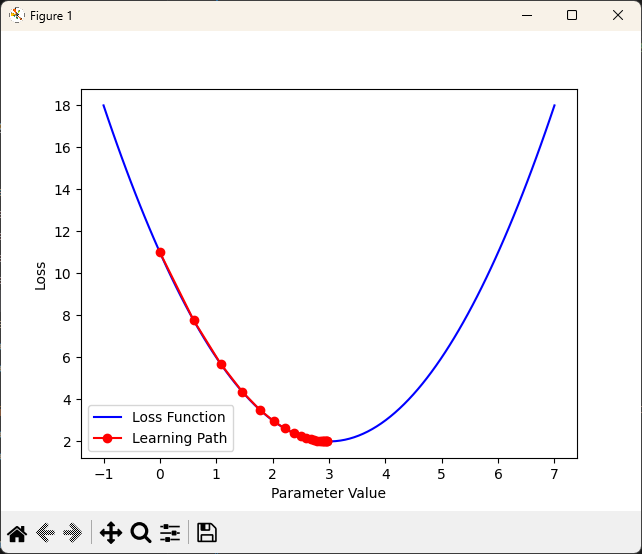
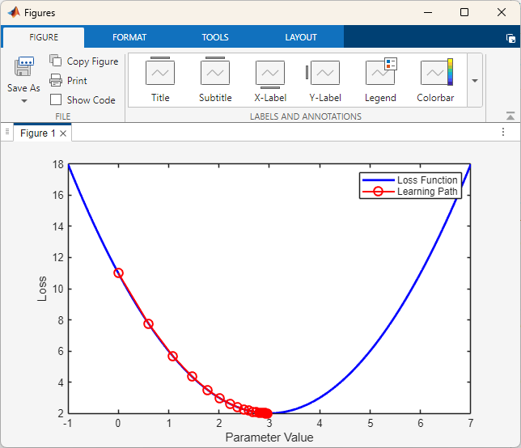

+++
date = '2025-10-08T06:00:00-07:00'
aliases = [
    "/posts/ptow-sympy-vs-numpy/",
    "how-large-language-models-learn",
]
draft = false
title = "How Large Language Models (LLMs) Learn: Calculus and the Search for Understanding"
subtitle = "Exploring how gradient descent and partial derivatives teach models to think"
categories = ["AI & The Mathematics of Language"]
tags = ["AI", "calculus", "gradient descent", "LLMs", "optimization",]
author = "Tom Archer"
listThumb = "how-large-language-models-learn3.png"
+++

<figure style="float: right; margin: 0 20px 10px 20px; width: 250px; text-align: center;">
  
  <figcaption style="font-size: 0.9em; color: #555; margin-top: 5px;">
    <em>Meaning takes shape as the model learns to descend its own mathematical terrain.</em>
  </figcaption>
</figure>

When you interact with a large language model (LLM) such as [ChatGPT](https://chatgpt.com/) or [Claude](https://claude.ai/new), the model seems to respond instantly relative to the question's degree of difficulty. What's easy to forget is that every word it predicts comes from a long history of learning where billions of gradient steps have slowly sculpted its understanding of language.

Large language models don't memorize text. They *optimize* it. Behind that optimization lies calculus. I'm not referring to the calculus you did with pencil and paper. I'm talking about a sprawling, automated version that computes millions of derivatives per second.

At its heart, every LLM is a feedback system. It starts with random guesses, measures how wrong it was, and then adjusts itself to be *slightly less wrong.* The word "slightly" in this context is the essence of calculus.  

---

>*"Each gradient step represents a measurable reduction in error, guiding the model toward a more stable understanding of language."*

---

<!--more-->

This post explores how derivatives guide learning, how gradients shape understanding, and how every improvement in an AI's intelligence begins with a single slope on a vast mathematical landscape. Think of that landscape as a terrain of error and knowledge: each ridge represents mistakes, each valley represents improvement, and the model's journey is one of descending that terrain toward understanding itself.

---

## The Role of Calculus in Learning

In the simplest terms, calculus gives LLMs the ability to *improve*. Specifically, it gives them a way to measure *change.*

When a model produces an output, it compares that output to the correct answer and computes a **loss**, a single number that represents error. But the key question is *how each parameter should change to make that loss smaller next time?*.

That question is answered by **derivatives.** A derivative tells the model how sensitive the loss is to a small change in one of its parameters. If the derivative is positive, the model nudges that parameter down; if it's negative, it nudges it up.

Repeat this process across billions of parameters, and what emerges is learning.

---

## The Landscape of Loss

You can think of training a model as trying to find the lowest point in a vast, invisible landscape, a mathematical surface defined by all possible combinations of parameter values.

Each point on that surface has a height (the loss). The model's job is to find the valleys where loss is minimal and predictions are most accurate.

Calculus provides the map. **Gradient descent** is the compass.

In one step of gradient descent, the model computes the slope (gradient) of the loss function with respect to its parameters, then moves a small step downhill. Too large a step and it overshoots; too small and training crawls.

The process is like sliding down a foggy mountain guided only by the steepness underfoot. But given enough iterations, it converges.

---

## Backpropagation: The Chain Rule in Action

For models with many layers, such as transformers, each parameter affects the output indirectly through multiple stages of computation. To determine how a change in an early weight influences the final result, we apply the **chain rule**, the backbone of backpropagation.

Backpropagation is the algorithm that carries error signals backward through the network, layer by layer, computing derivatives at each stage.

In mathematical shorthand, if `L` is the loss and `W` represents the weights, we compute the following for every parameter. The result is a gradient that tells us how much each weight contributed to the total error:

\\[
\frac{\partial L}{\partial W}
\\]

The model then updates each weight according to the rule below, where `η` (eta) is the **learning rate**, representing the size of the step taken down the loss gradient:

\\[
W_{new} = W_{old} - \eta \frac{\partial L}{\partial W}
\\]

---

## Visualizing the Descent

The abstract mathematics of gradient descent becomes clearer when you can see it move. Here's a simple Python example that shows how a model "learns" to find the minimum of a function:

```python
import numpy as np
import matplotlib.pyplot as plt

# Define a simple loss function: f(x) = (x - 3)^2 + 2
def loss(x):
    return (x - 3)**2 + 2

def gradient(x):
    return 2 * (x - 3)

# Gradient descent
x = 0  # Start far from the minimum
learning_rate = 0.1
history = [x]

for _ in range(20):
    grad = gradient(x)
    x = x - learning_rate * grad
    history.append(x)

# Visualize
x_vals = np.linspace(-1, 7, 100)
plt.plot(x_vals, loss(x_vals), 'b-', label='Loss Function')
plt.plot(history, [loss(x) for x in history], 'ro-', 
          label='Learning Path')
plt.xlabel('Parameter Value')
plt.ylabel('Loss')
plt.legend()
plt.show()
```

The preceding Python code generates the following plot:



Watch how the red dots trace a path downhill. Each step is smaller than the last as the gradient flattens near the minimum. That final convergence, where changes become microscopic, is the model settling into understanding.

In MATLAB, the same principle appears even more elegantly:

```matlab
% Loss function and its derivative
f = @(x) (x - 3).^2 + 2;
df = @(x) 2 * (x - 3);

% Gradient descent
x = 0;
eta = 0.1;
history = x;

for i = 1:20
    x = x - eta * df(x);
    history(end+1) = x;
end

% Plot
x_vals = linspace(-1, 7, 100);
plot(x_vals, f(x_vals), 'b-', 'LineWidth', 2);
hold on;
plot(history, f(history), 'ro-', 'MarkerSize', 8, 'LineWidth', 1.5);
xlabel('Parameter Value');
ylabel('Loss');
legend('Loss Function', 'Learning Path');
```

The preceding MATLAB commands generate the following plot:



This toy example has one parameter. Real LLMs have billions. But the principle scales: each parameter follows its own gradient, and together they navigate a landscape far too vast to visualize, yet mathematically identical in structure.

---

## Optimization as Controlled Chaos

Training doesn't happen neatly. Real-world loss landscapes aren't smooth bowls; they're chaotic terrains full of cliffs, ridges, and deceptive plateaus.

That's why optimization relies on heuristics like **momentum**, **Adam**, and **RMSProp**, which are refinements that stabilize learning by dampening oscillations and adapting step sizes.

These techniques don't change the calculus itself. They refine how it's applied, balancing speed and stability so that models reach better minima without falling into traps.

If linear algebra gives LLMs their *structure*, calculus gives them *motion*.

---

## When Learning Gets Stuck

Not all valleys lead to wisdom. Sometimes gradient descent finds a **local minimum**, a point lower than its immediate surroundings but not the deepest point in the landscape. Imagine descending a mountain in fog and stopping in a small depression, unaware that a deeper valley lies just beyond the next ridge.

In practice, neural networks rarely suffer from local minima the way early researchers feared. The blessing of high-dimensional spaces is that most "stuck points" aren't true minima at all; they're **saddle points**, locations where the gradient is zero but escape routes exist in other dimensions.

Think of a mountain pass: flat in one direction, sloped in another. In two dimensions, you might see it as a trap. In a thousand dimensions, there are 998 other directions to explore.

Modern optimization techniques exploit this. **Momentum** helps the model roll through shallow local minima by accumulating velocity from previous gradients:

\\[
v_t = \beta v_{t-1} + \eta \frac{\partial L}{\partial W}
\\]
\\[
W_{new} = W_{old} - v_t
\\]

Where `β` (beta) controls how much past motion influences the current step. A model with momentum doesn't stop at the first flat spot; it carries enough inertia to climb small hills and find deeper valleys.

The result is a learning process that's robust to the chaotic topology of real loss landscapes. Models don't find the absolute best solution; they find solutions good enough to generalize, which in machine learning is often more valuable than perfection.

---

## The Learning Rate Dilemma

The learning rate `η` might be the most consequential number in all of AI training. Set it too high, and the model oscillates wildly, overshooting every minimum. Set it too low, and training becomes glacially slow, potentially stalling in poor solutions.

Consider this analogy: You're hiking down a mountain in dense fog. A large learning rate is like taking giant leaps—you cover ground quickly but might vault past the trail into a ravine. A small learning rate is like shuffling forward in tiny steps—safe but exhausting, and you might never reach the bottom before nightfall.

Early in training, when the model's predictions are far from accurate, a larger learning rate helps it make bold corrections. But as it approaches a good solution, those same large steps become destructive, bouncing around the minimum rather than settling into it.

That's why modern training uses **learning rate schedules**. One popular approach is **cosine annealing**, where the rate decreases smoothly over time:

\\[
\eta_t = \eta_{min} + \frac{1}{2}(\eta_{max} - \eta_{min})(1 + \cos(\frac{t\pi}{T}))
\\]

Where `t` is the current step and `T` is the total number of steps. The learning rate starts high, enabling rapid initial progress, then gradually decreases, allowing fine-tuned convergence.

Another strategy, **warm restarts**, periodically resets the learning rate to a higher value. This seems counterintuitive, but it helps the model escape shallow local minima it might have settled into, exploring new regions of parameter space before converging again.

The learning rate isn't just a technical detail. It's the rhythm of learning itself, the balance between exploration and refinement that defines how quickly, and how well, a model understands the world.

---

## Stochastic vs. Batch: Why Noise Helps

You might expect that using all available data at every step would produce the best learning. Calculate the exact gradient over the entire training set, then update. This is called **batch gradient descent**, and while theoretically elegant, it's computationally expensive and, surprisingly, often inferior.

Instead, most modern models use **stochastic gradient descent (SGD)** or **mini-batch gradient descent**, computing gradients on small random subsets of data. Each update is noisier, less precise, but this noise is a feature, not a bug.

Why? Because noise prevents premature convergence. When you compute gradients on random batches, each update pushes the model in a slightly different direction. Sometimes these pushes help the model escape narrow valleys that fit the training data but don't generalize well. The randomness acts as a regularizer, preventing overfitting.

Think of it like this: batch gradient descent is like having a detailed map and following it precisely. Stochastic gradient descent is like wandering with a rough sketch, taking occasional detours. The wanderer often discovers more robust paths because they're forced to test different routes.

Mathematically, a mini-batch gradient is an *estimate* of the true gradient:

\\[
\frac{\partial L}{\partial W} \approx \frac{1}{|B|} \sum_{i \in B} \frac{\partial L_i}{\partial W}
\\]

Where `B` is a randomly sampled mini-batch and `L_i` is the loss on example `i`. The approximation introduces variance, but averaged over many steps, it converges to the same destination as the exact gradient—often faster and with better generalization.

Modern systems strike a balance. Batch sizes of 32, 64, or 256 are common—large enough to stabilize gradients through averaging, small enough to maintain beneficial stochasticity. In the training of LLMs, this balance between precision and exploration shapes not just speed but the fundamental character of what the model learns.

---

## Learning as Compression

In a sense, every gradient update compresses experience. The model takes the difference between its prediction and reality, distills that error into a small numerical change, and encodes it into its parameters.

Over billions of updates, those tiny corrections accumulate into knowledge, forming patterns of weights that capture the statistical structure of language, code, and reasoning.

The calculus disappears, leaving behind intuition embedded in numbers.

---

## From Theory to Transformers

Everything discussed so far applies to neural networks generally, but transformers—the architecture behind GPT, Claude, and most modern LLMs—introduce unique optimization challenges.

The **attention mechanism**, which allows models to weigh the relevance of different tokens dynamically, creates an especially complex loss landscape. Each attention head learns to focus on different patterns: one might track subject-verb agreement, another might capture long-range dependencies, another might specialize in code syntax.

During backpropagation, gradients must flow through these attention layers, through multiple residual connections, and across potentially thousands of tokens in the context window. This creates two problems:

1. **Vanishing gradients**: In deep networks, gradients can shrink exponentially as they propagate backward, making early layers learn slowly.
2. **Exploding gradients**: Conversely, gradients can grow uncontrollably, destabilizing training.

Transformers mitigate these issues through **layer normalization** and **residual connections**. Layer normalization rescales activations at each layer, keeping values in a stable range. Residual connections provide "shortcut" paths for gradients to flow directly through the network, preventing them from vanishing.

The optimization of attention weights is particularly elegant. When the model computes attention, it's asking: "Given this query, which keys are most relevant?" The gradients then adjust those relevance scores based on whether the resulting predictions were accurate.

In essence, backpropagation through attention teaches the model *where to look*. Not just what patterns exist, but which patterns matter in which contexts. That selective focus, refined through billions of gradient updates, is what allows a 70-billion-parameter model to write coherent code or hold nuanced conversations.

The calculus doesn't change. But the structure it optimizes—the intricate dance of attention across layers and tokens—creates something that feels less like pattern matching and more like understanding.

---

## From Mistake to Meaning

All machine learning begins in error. The genius of calculus is that it makes error useful.

Every misprediction becomes information about *direction*, showing the model where to go next.

**That is what makes AI training so remarkable: it doesn't eliminate mistakes; it learns from them.**

So when a large language model finishes your sentence, it's not recalling a rule or retrieving a fact. It's the product of countless adjustments, each one a derivative of failure, converging toward meaning.

---

## The Paradox of Convergence

There's a strange tension at the heart of model training. On one hand, we want the loss to decrease, to converge toward zero error. On the other hand, a model that perfectly fits its training data has learned nothing useful—it has merely memorized.

The goal isn't perfection. It's **calibrated uncertainty**.

This is why validation loss matters as much as training loss. As a model trains, its performance on training data improves monotonically. But performance on held-out validation data follows a U-curve: it improves, reaches a minimum, then begins to worsen as the model overfits.

The optimal stopping point isn't when training loss bottoms out. It's when validation loss does. That moment represents the best balance between learning general patterns and avoiding memorization. Modern training uses **early stopping**, monitoring validation loss and halting when it stops improving.

Calculus drives the model downward, but human judgment decides when to stop the descent.

There's a deeper paradox here, too. The more parameters a model has, the more it can memorize, yet large models often generalize *better* than small ones. This counterintuitive phenomenon, sometimes called **benign overfitting** or the **double descent curve**, suggests that in the regime of massive overparameterization, the optimization process itself acts as a regularizer.

When there are far more parameters than data points, gradient descent tends to find solutions that are not just accurate but *simple* in some implicit sense. The model has so much capacity that it can afford to encode patterns smoothly rather than sharply, resulting in better generalization despite apparent overfitting.

This remains one of the most fascinating open questions in deep learning theory: why does more capacity, optimized with simple calculus, lead to more understanding rather than less?

---

## The Geometry of Improvement

If embeddings give models their spatial structure and calculus gives them motion, then learning is the process of reshaping that space itself.

Every gradient update subtly warps the embedding landscape. Words that were distant drift closer; directions that were irrelevant become meaningful. The model doesn't just navigate its geometric world—it sculpts it, iteration by iteration.

In a sense, training is a dialogue between data and geometry. The data says, "These patterns matter." The gradients respond, "Then let me bend space to make them visible."

After enough iterations, the space itself becomes a compressed representation of everything the model has seen—every sentence, every code snippet, every correction. That geometry, invisible to us but foundational to the model, is where meaning lives.

---

## Closing Thoughts

After many years working with both the mathematics and the philosophy of computation, I've come to see gradient descent as something almost biological. It's not conscious, but it's adaptive. It doesn't reason, but it responds. It doesn't understand loss the way we understand failure, but it learns from it just the same.

When you ask an LLM a question and it responds, what you're seeing is the endpoint of billions of derivative calculations, each one a small adjustment, a tiny correction, a marginal improvement. That intelligence, if we can call it that, isn't designed. It's *descended into*.

Calculus gives models the ability to fail productively. Linear algebra gives them the structure to remember. Together, they create systems that improve through experience, that encode knowledge through error, that find meaning by following slopes we can compute but never fully visualize.

And perhaps that's the most human thing about them: they learn not by being told what's right, but by discovering, step by step, how to be less wrong.

---

**If you've followed this series from [how LLMs read code](/posts/how-large-language-models-read-code) through [how they think](/posts/how-large-language-models-think) to [how they learn](/posts/how-large-language-models-learn) (this post), you've traced the full arc: from pattern recognition to geometric reasoning to calculus-driven improvement. What emerges isn't magic. It's mathematics in motion, and it's far more remarkable than magic ever could be.**

---
