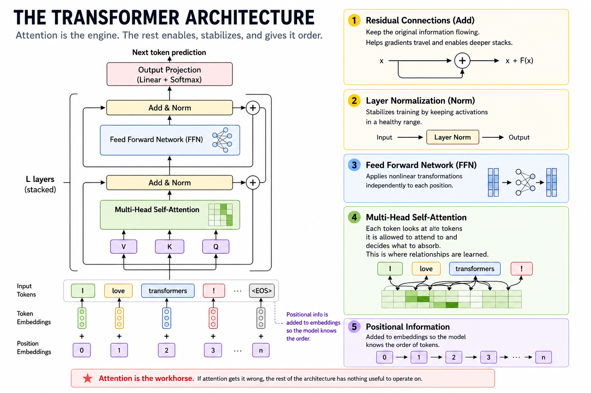
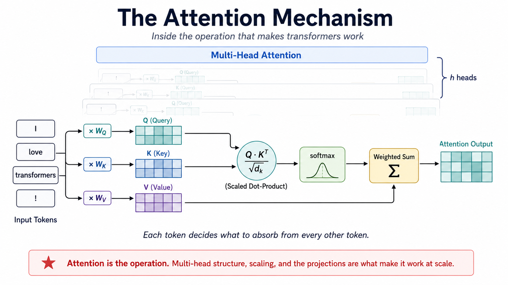

+++
date = '2026-08-22T06:00:00-07:00'
draft = false
title = "Inside Attention, Part 1: The Mechanism"
subtitle = "What 'Attention Is All You Need' defined, and what we have learned since about how it works"
categories = ["AI and the Mathematics of Language"]
tags = ["AI", "attention mechanisms", "induction heads", "interpretability", "LLM", "softmax", "transformers"]
author = "Tom Archer"
listThumb = "inside-attention-part-1-thumb.png"
+++

<figure style="margin: 0 20px 10px 20px; text-align: center;">
    
    <figcaption style="font-size: 0.9em; color: #555; margin-top: 5px;">
        <em>A simplified transformer architecture showing how attention layers, feedforward networks, residual connections, layer normalization, and positional information work together. Attention is the mechanism that determines what information each token absorbs from the sequence.</em>
    </figcaption>
</figure>

<div style="float: right; width: 40%; margin: 0 0 1em 1em; padding: 0.5em; background-color: #f8f8f8; border: 1px solid #ddd; font-size: 0.9em;">
    <div style="text-align: center;"><strong>What You'll Learn</strong><br><br></div>
After reading this post, you'll be able to explain:

- What queries, keys, and values do
- How scaled dot-product attention works
- Why attention divides by \\(\sqrt{d_k}\\)
- Why transformers use multiple heads
- What attention heads actually learn
- How induction heads enable pattern copying
</div>

The transformer architecture is composed of many repeating transformer layers, or blocks. Each block contains an attention sublayer followed by a feedforward sublayer, wrapped in residual connections and layer normalization. Positional information is added to the input so the model knows what order the tokens came in. The attention sublayer sets the table for the feedforward sublayer: it does the work of looking at other tokens and deciding what information to absorb from them. Get attention wrong and the rest of the architecture has nothing useful to operate on.

This post is the first of a three-part series on the attention mechanism. Part 1 covers scaled dot-product attention, why we divide by \\(\sqrt{d_k}\\), multi-head attention, and what interpretability research has revealed about the patterns and circuits attention can learn. Part 2 covers masking and the function class it forces the model into, including how causal masking turns self-attention into the foundation of autoregressive next-token prediction. Part 3 covers the engineering layer: KV caching, multi-query and grouped-query attention, sliding window attention, and Flash Attention.

The 2017 paper, [Attention Is All You Need](#vaswani2017) is the seed of this series. The mechanism it described is small and elegant enough to fit on a page. Everything since has been the tree growing out of it: the core mathematics has held up, while the deployed system has acquired layers the paper did not anticipate. Part 1 stays close to the seed. Parts 2 and 3 walk the branches.

---

> *"Attention is the engine. The rest of the transformer architecture stabilizes it, organizes it, and makes deep training possible."*

---

<!--more-->

This post explores the attention operation as it appears in the original paper and as it is understood today. You will see the variance argument behind the \\(\sqrt{d_k}\\) scaling, the parameter-budget structure of multi-head attention, and the post-2017 mechanistic interpretability work that identified specific algorithms running inside trained models. If you have followed my earlier posts on how LLMs think and how they learn, you have already seen the calculus, linear algebra, and probability that surround attention. This post goes inside the operation itself.

> **TL;DR:**
> * Attention computes a content-based weighted aggregation: similarity scores between queries and keys, softmaxed into a distribution, applied to values
> * The \\(\sqrt{d_k}\\) scaling exists because dot-product variance grows linearly with \\(d_k\\), and unscaled softmax saturates toward one-hot at large \\(d_k\\), which collapses gradients
> * Multi-head attention is a parameter-budget-neutral split that creates room for parallel specialization
> * What heads actually learn after training has been studied empirically since 2019; the cleanest result is the induction head, a circuit that implements a match-and-copy algorithm and provides one mechanistic account of an important form of in-context learning
> * The mechanism is not just a learned similarity function; it is a substrate on which identifiable algorithms emerge

---

## The Equation

<figure style="margin: 0 20px 10px 20px; text-align: center;">
    
    <figcaption style="font-size: 0.9em; color: #555; margin-top: 5px;">
        <em>The attention operation. Learned projections produce queries, keys, and values; scaled dot products and softmax determine how strongly each position attends to the others; and the resulting weights determine how the value vectors are combined.</em>
    </figcaption>
</figure>

Attention takes a sequence of token representations and produces a new sequence in which each position is a weighted blend of all the others. The blend is content-based: tokens decide for themselves how much of every other token to absorb.

The [Vaswani paper](#vaswani2017) states the operation in one equation:

\\[
\text{Attention}(Q, K, V) = \text{softmax}\left(\frac{QK^T}{\sqrt{d_k}}\right)V
\\]

Three matrices, all derived from the input by separate learned linear projections.

- Query (Q): what each position is looking for
- Key (K): what each position offers as a match target
- Value (V): what each position contributes if it is matched

The product \\(QK^T\\) is the matrix of all pairwise similarity scores. Softmax turns each row of that matrix into a probability distribution over positions. Multiplying by \\(V\\) blends the value vectors using those probabilities.

**Python**
```python
import numpy as np

def softmax(x, axis=-1):
    x = x - x.max(axis=axis, keepdims=True)
    e = np.exp(x)
    return e / e.sum(axis=axis, keepdims=True)

def attention(Q, K, V):
    d_k = Q.shape[-1]
    scores = Q @ K.T / np.sqrt(d_k)
    weights = softmax(scores, axis=-1)
    return weights @ V, weights

seq_len, d_model = 5, 8
X = np.random.randn(seq_len, d_model)

W_Q = np.random.randn(d_model, d_model) * 0.1
W_K = np.random.randn(d_model, d_model) * 0.1
W_V = np.random.randn(d_model, d_model) * 0.1

Q, K, V = X @ W_Q, X @ W_K, X @ W_V
out, weights = attention(Q, K, V)

print("Attention weights (rows sum to 1):")
print(np.round(weights, 3))
```

**Output**

```
Attention weights (rows sum to 1):
[[0.177 0.213 0.174 0.175 0.261]
 [0.198 0.201 0.197 0.2   0.204]
 [0.219 0.197 0.23  0.196 0.158]
 [0.203 0.198 0.203 0.194 0.201]
 [0.199 0.186 0.184 0.226 0.204]]
```

The thing to internalize is that nothing here is hand-coded. \\(W_Q\\), \\(W_K\\), and \\(W_V\\) are parameters the optimizer learns. Whatever notion of "matching" the model needs to do its job, it has to discover and encode in those three matrices. The architecture provides the operation; training provides the content.

---

## The \\(\sqrt{d_k}\\) Scaling

The scaling factor looks like an implementation detail. It is not. Without it, the variance of the dot products grows with the key dimension, pushing softmax toward saturation and making optimization increasingly difficult as \\(\sqrt{d_k}\\) grows.

The Vaswani paper offers exactly one sentence of motivation, in section 3.2.1: "We suspect that for large values of \\(d_k\\), the dot products grow large in magnitude, pushing the softmax function into regions where it has extremely small gradients." That is correct, and it is asserted rather than derived. The derivation is short and worth working through.
Suppose the entries of \\(Q\\) and \\(K\\) are roughly independent with mean 0 and variance 1. A single entry of \\(QK^T\\) is a sum of \\(d_k\\) products of independent unit-variance variables. The variance of that sum is the sum of the variances:

\\[
\text{Var}(q \cdot k) = \sum_{i=1}^{d_k} \text{Var}(q_i k_i) \approx d_k
\\]

Standard deviation is therefore \\(\sqrt{d_k}\\). When \\(d_k = 64\\), raw scores have standard deviation 8. When \\(d_k = 1024\\), standard deviation is 32. Push values that large into a softmax and the distribution collapses toward one-hot: one position takes nearly all the mass, others round to zero. Once that happens, gradients with respect to non-winning positions become tiny, and the model stops getting useful learning signal from them.
Dividing by \\(\sqrt{d_k}\\) cancels the variance growth and keeps softmax in a usable regime.

**Python**
```python
import numpy as np

np.random.seed(1)

def show_scaling_effect(d_k, n_tokens=512):
    Q = np.random.randn(n_tokens, d_k)
    K = np.random.randn(n_tokens, d_k)

    raw = Q @ K.T
    scaled = raw / np.sqrt(d_k)

    sm_raw = np.exp(raw[0] - raw[0].max())
    sm_raw /= sm_raw.sum()

    sm_scaled = np.exp(scaled[0] - scaled[0].max())
    sm_scaled /= sm_scaled.sum()

    print(f"d_k = {d_k:>4}")
    print(f"  Raw    QK^T variance: {raw.var():>8.2f}")
    print(f"  Scaled QK^T variance: {scaled.var():>8.2f}")
    print(f"  Raw    softmax max weight: {sm_raw.max():.4f}")
    print(f"  Scaled softmax max weight: {sm_scaled.max():.4f}")
    print()

for d_k in [16, 64, 256, 1024]:
    show_scaling_effect(d_k)
```
Output
```
d_k =   16
  Raw    QK^T variance:    15.85
  Scaled QK^T variance:     0.99
  Raw    softmax max weight: 0.5720
  Scaled softmax max weight: 0.0422

d_k =   64
  Raw    QK^T variance:    63.86
  Scaled QK^T variance:     1.00
  Raw    softmax max weight: 0.9911
  Scaled softmax max weight: 0.0346

d_k =  256
  Raw    QK^T variance:   256.00
  Scaled QK^T variance:     1.00
  Raw    softmax max weight: 0.9997
  Scaled softmax max weight: 0.0346

d_k = 1024
  Raw    QK^T variance:  1021.38
  Scaled QK^T variance:     1.00
  Raw    softmax max weight: 1.0000
  Scaled softmax max weight: 0.0249
```
Variance grows linearly in \\(d_k\\) on the unscaled side and stays at 1 on the scaled side. By \\(d_k = 64\\) the unscaled softmax is already heavily concentrated. By \\(d_k = 256\\) it is essentially one-hot.

The "small gradients" argument is the second half of the story. The Jacobian of softmax has the form \\(\partial y_i / \partial x_j = y_i(\delta_{ij} - y_j)\\). When the distribution is uniform, every input position receives a meaningful share of gradient. When the distribution is saturated, almost all of the Jacobian's mass is concentrated on the row and column of the dominant position. Non-dominant positions become invisible to the optimizer.

The cleanest way to see this is to measure two things at the same \\(d_k\\): how spread the softmax distribution is, and how concentrated the gradient flow is.

**Python**
```python
import numpy as np

def softmax_jacobian(x):
    y = softmax(x, axis=-1)
    return np.diag(y) - np.outer(y, y)

def effective_positions(p):
    # exp(entropy): how many positions effectively receive weight
    H = -np.sum(p * np.log(p + 1e-30))
    return np.exp(H)

np.random.seed(7)
d_k, n = 256, 64

Q = np.random.randn(d_k)
K = np.random.randn(n, d_k)
raw_logits = K @ Q
scaled_logits = raw_logits / np.sqrt(d_k)

p_raw = softmax(raw_logits)
p_scaled = softmax(scaled_logits)

J_raw = softmax_jacobian(raw_logits)
J_scaled = softmax_jacobian(scaled_logits)

# Column sum of |J[:, j]| = total gradient flowing back through input j
flow_raw = np.abs(J_raw).sum(axis=0)
flow_scaled = np.abs(J_scaled).sum(axis=0)

print(f"Effective positions receiving signal (exp of entropy):")
print(f"  Raw    : {effective_positions(p_raw):>5.2f}  out of {n}")
print(f"  Scaled : {effective_positions(p_scaled):>5.2f}  out of {n}")
print()
print(f"Top-1 share of total gradient flow:")
print(f"  Raw    : {flow_raw.max() / flow_raw.sum():.4f}")
print(f"  Scaled : {flow_scaled.max() / flow_scaled.sum():.4f}")
```
Output
```
Effective positions receiving signal (exp of entropy):
  Raw    :  1.96  out of 64
  Scaled : 48.08  out of 64

Top-1 share of total gradient flow:
  Raw    : 0.4778
  Scaled : 0.0525
```
Two numbers tell the whole story. Without scaling, attention spreads its weight across about 2 effective positions out of 64, and 48% of the gradient signal funnels through a single input. With scaling, attention spreads across roughly 48 effective positions and gradient flows much more broadly. The scaled version preserves a much healthier learning signal. Without scaling, most positions receive very little gradient because the softmax has concentrated so strongly on a small number of positions.

The \\(\sqrt{d_k}\\) correction is numerical hygiene, not architectural cleverness. The paper's one-sentence assertion has a clean derivation behind it, and skipping the derivation is the kind of thing that hides where actual fragility lives in a deep network.

---

## Multi-Head Attention

A single attention head produces one attention distribution from one learned query-key projection. That projection can encode complicated relationships, but every relationship it represents must coexist within the same attention pattern. Real language has many simultaneous structures: subject-verb agreement, coreference, syntactic dependency, topical similarity, positional rhythm. One similarity function will not capture all of them.
Multi-head attention runs several attention operations in parallel, each with its own learned projections, then concatenates the outputs and projects back down to the model dimension.

\\[
\text{MultiHead}(X) = \text{Concat}(\text{head}_1, \ldots, \text{head}_h)W^O
\\]

\\[
\text{head}_i = \text{Attention}(X W_i^Q, X W_i^K, X W_i^V)
\\]

The parameter budget is the part most explanations skip. In the standard construction, where \\(h\\) heads each have dimension \\(d_{\text{model}} / h\\), the projections across all heads have, in total, the same parameter count as a single set of full-width projections.

**Python**
```python
import numpy as np

def multi_head_attention(X, n_heads=4):
    seq_len, d_model = X.shape
    d_head = d_model // n_heads

    W_Q = np.random.randn(d_model, d_model) * 0.1
    W_K = np.random.randn(d_model, d_model) * 0.1
    W_V = np.random.randn(d_model, d_model) * 0.1
    W_O = np.random.randn(d_model, d_model) * 0.1

    Q = (X @ W_Q).reshape(seq_len, n_heads, d_head)
    K = (X @ W_K).reshape(seq_len, n_heads, d_head)
    V = (X @ W_V).reshape(seq_len, n_heads, d_head)

    head_outputs = []
    for h in range(n_heads):
        Qh, Kh, Vh = Q[:, h, :], K[:, h, :], V[:, h, :]
        scores = Qh @ Kh.T / np.sqrt(d_head)
        weights = softmax(scores)
        head_outputs.append(weights @ Vh)

    concat = np.concatenate(head_outputs, axis=-1)
    return concat @ W_O

np.random.seed(2)
X = np.random.randn(8, 32)
out = multi_head_attention(X, n_heads=4)
print(f"Input shape:  {X.shape}")
print(f"Output shape: {out.shape}")
```

**Output**
```
Input shape:  (8, 32)
Output shape: (8, 32)
```
The paper proposed multi-head attention as a hypothesis: it expected the architecture to permit different kinds of attention patterns to coexist. What heads actually learn was not answered in the paper. It was answered later.

---

## What Heads Actually Learn

The first wave of work on attention head behavior, in 2019, looked at trained BERT and machine translation models and asked what individual heads were doing ([Voita et al., 2019](#voita2019); [Clark et al., 2019](#clark2019)). The findings were partial but striking. Many heads attended to the previous token, the next token, the start of the sequence, or special tokens like `[CLS]` and `[SEP]`. Some heads tracked syntactic relations: the head of a noun phrase, the matching bracket, the subject of a verb. Some tracked coreference. A substantial fraction of heads were not interpretable, and many could be pruned without measurable performance loss.

That was a useful first pass, but the more consequential result came from a different direction. In 2021 and 2022, researchers in mechanistic interpretability set out to reverse-engineer specific circuits inside small transformers ([Elhage et al., 2021](#elhage2021); [Olsson et al., 2022](#olsson2022)). They were not just identifying which positions a head paid attention to. They were identifying the algorithms that circuits implemented and testing those explanations through interventions such as ablation.

The cleanest result from that work is the induction head ([Olsson et al., 2022](#olsson2022)). An induction head is a two-layer circuit that implements a simple algorithm: given a context that contains a previous instance of the current token, predict whatever followed that previous instance. If the model has seen `... A B ... A`, the induction head circuit predicts `B`.

The mechanism takes two layers of attention working in composition.
Layer 1 hosts a previous-token head. Every position attends to the position immediately before it and copies information about that previous token into its own residual stream. After layer 1, the position holding token `B` (after the first `A`) has effectively been annotated with "the token before me was `A`."

Layer 2 hosts the induction head proper. At each position, the query asks "I am token \\(T\\), find positions whose previous token was \\(T\\)." Because layer 1 wrote previous-token information into every position's keys, the match is well-defined. The query lights up at the position holding `B`. The value at that position carries information about `B` itself, which gets copied into the current position's residual stream and biases the next-token prediction toward `B`.

This is more than a similarity heuristic. It is a learned algorithm composed across two attention layers, and closely related induction-head circuits have been observed in transformers trained from scratch across different model sizes and training settings. We can sketch the attention pattern that this circuit produces by hand and see why it works.

**Python**
```python
import numpy as np

tokens = ['A', 'B', 'C', 'D', 'A', 'B']
n = len(tokens)

# Layer 1: previous-token head. Each position attends to position-1.
layer1 = np.zeros((n, n))
for i in range(n):
    layer1[i, max(0, i - 1)] = 1.0

# Layer 2: induction head. Position i (current token T) attends to
# position j where token[j-1] == T. After layer 1, position j's keys
# advertise "I follow token[j-1]", so this match is well-defined.
layer2 = np.zeros((n, n))
for i in range(n):
    current = tokens[i]
    matches = [j for j in range(1, i + 1) if tokens[j - 1] == current]
    if matches:
        w = 1.0 / len(matches)
        for j in matches:
            layer2[i, j] = w
    else:
        layer2[i, i] = 1.0

print("Sequence:", " ".join(tokens))
print()
print("Layer 2 attention (induction head):")
print("       " + "    ".join(str(i) for i in range(n)))
for i in range(n):
    row = "  ".join(f"{layer2[i,j]:.1f}" for j in range(n))
    print(f"  {i}({tokens[i]}): {row}")
```

**Output**

```
Sequence: A B C D A B

Layer 2 attention (induction head):
       0    1    2    3    4    5
  0(A): 1.0  0.0  0.0  0.0  0.0  0.0
  1(B): 0.0  1.0  0.0  0.0  0.0  0.0
  2(C): 0.0  0.0  1.0  0.0  0.0  0.0
  3(D): 0.0  0.0  0.0  1.0  0.0  0.0
  4(A): 0.0  1.0  0.0  0.0  0.0  0.0
  5(B): 0.0  0.0  1.0  0.0  0.0  0.0
```

The pattern at row 4, the second `A`, is the whole point. The head attends to position 1, which holds token `B`, the token that followed `A` last time. The same pattern appears at row 5, where the second `B` attends to position 2 (token `C`), the token that followed `B` last time. The circuit has effectively built a one-shot lookup table from earlier in the sequence.

This matters because the induction head is one of the few mechanistically explained accounts we have for in-context learning, the property that lets a model adapt to patterns inside a single prompt without parameter updates. When a model encounters a repeated pattern in context and uses an earlier instance to predict its continuation, an induction circuit provides a mechanistic explanation for how that behavior can arise without parameter updates.

Induction heads are not a complete explanation of in-context learning, and subsequent work has identified richer circuits and mechanisms. But they remain one of the cleanest examples of an algorithm that researchers have identified inside a trained transformer. 

A footnote on tooling: working with these circuits in real models is much easier with TransformerLens, an open-source Python library specifically built for this kind of analysis. The hand-constructed sketch above shows what the pattern looks like in principle. TransformerLens lets you observe it in trained GPT-2 and other open-weight models.

---

## Why the Mechanism Has the Shape It Does

Five facts about the operation tie together once you have walked through the pieces.
The `Q`, `K`, `V` split is not redundant. Three separate projections give the model independent control over what it queries with, what it offers as a match target, and what it contributes when matched. A single shared projection would tie those roles together and lose expressive power. The cost is three weight matrices instead of one. The benefit is that the function each token serves can change depending on what other tokens are looking for.

The \\(\sqrt{d_k}\\) scaling is what makes attention trainable at scale. Without it, anything past a small embedding dimension produces saturated softmax distributions and starves most positions of gradient. The scaling has no effect on the operation's expressiveness; it preserves trainability. In hindsight it is the kind of fix that obviously had to exist for the architecture to work at all, and the fact that it appeared in the original paper at the right strength is one of the things that paper got right.

Multi-head attention is a structural bet on diversity. Splitting the model dimension across independently learned heads gives the model room to represent different attention patterns in parallel. Trained models do exhibit this specialization, but not uniformly: some heads learn identifiable roles while others are redundant enough to prune with little or no measurable performance loss.

Attention is a substrate for algorithms, not just a similarity function. This is the lesson of induction heads. The mechanism is general enough that simple algorithms can be expressed as circuits across a few layers, and training reliably finds them. The model is not just learning to look at related words; it is learning to compose attention heads into computations.

Most of what happens inside attention is still not interpretable. The work since 2019 has identified specific circuits and head roles, but it has not produced a complete map. A trained transformer at scale runs many heads whose function we cannot describe. The mechanism is open enough that what it learns continues to surprise the people studying it.

---

## From the Paper to the Mechanism Today

The [2017 paper](#vaswani2017) is small. What we have learned about the mechanism since then is large. The table below maps each component of the operation to what we now understand it to provide.

### Mechanism Component	What It Provides

- **Q, K, V split**: Independent control over query, match target, and value contribution
- **\\(\sqrt{d_k}\\) scaling**: Variance normalization that keeps softmax in a trainable regime
- **Multi-head attention**: Parameter-equivalent split that creates room for parallel specialization
- **Stacked attention layers**: Substrate on which two-layer circuits like induction heads emerge
- **Trained head behavior**: Identifiable algorithms and patterns, not just learned similarity functions

The seed and tree metaphor is meant to capture this exact relationship. The seed is small. The tree is large. The work of understanding the system is the work of seeing how the structures in the seed grew into the algorithms running on the branches.

---

## What Comes Next?

Part 2 of this series moves to masking. The mechanism described above is unmasked: every position is allowed to attend to every other position. Real transformers almost never use it that way. The decoder-only architecture that defines GPT, Llama, Mistral, and most current open-weight models uses causal masking, which restricts each position to attend only to its predecessors. That structural choice prevents each position from seeing future tokens, making the attention mechanism compatible with autoregressive next-token prediction and generation. It also constrains what kinds of functions the model can learn, in ways the Vaswani paper does not articulate but which run further than the architecture itself. The function-class consequences of training a model to predict each token from its predecessors, on text that human authors wrote to flow continuously, are deeper than they look. That is one of the questions Part 2 sets up.

Part 3 then turns to the production stack. The mechanism in this post does not run in deployed models exactly as described. The KV cache problem, multi-query and grouped-query attention, sliding window attention, and Flash Attention are the engineering layer that exists because the textbook formula does not survive scale.

---

## Closing Thoughts

The [2017 paper](#vaswani2017) gave us an operation that fits on a page. What we have learned since is that this operation is more capable than its inventors fully knew. The \\(\sqrt{d_k}\\) scaling has a derivation behind its one-sentence justification. Multi-head attention turned out to be a substrate for emergent algorithms, not just a way to mix similarity functions. Specific circuits like induction heads now have mechanistic explanations, and those explanations are part of how we understand in-context learning at all.

Attention is one equation. Understanding what it does is the work of the years that followed. The discrete math post in this series argued that calculus, linear algebra, probability, and discrete mathematics are not separate subjects in modern AI but interconnected views of the same structures. Attention is the cleanest place to see that argument made concrete. It is a linear algebra operation, a probability distribution, a soft predicate, and a substrate for learned algorithms, all at once. Part 2 will look at what that substrate is allowed to see, and what changes when we restrict its view.

---

## Further Reading

These are the primary sources behind the architecture and mechanistic interpretability findings discussed above.

<p id="clark2019" style="margin-left: 2em; text-indent: -2em;">
Clark, K., Khandelwal, U., Levy, O., &amp; Manning, C. D. (2019). What does BERT look at? An analysis of BERT's attention. <em>Proceedings of the 2019 ACL Workshop BlackboxNLP: Analyzing and Interpreting Neural Networks for NLP</em>. <a href="https://arxiv.org/abs/1906.04341">https://arxiv.org/abs/1906.04341</a>
</p>

<p id="elhage2021" style="margin-left: 2em; text-indent: -2em;">
Elhage, N., Nanda, N., Olsson, C., Henighan, T., Joseph, N., Mann, B., Askell, A., Bai, Y., Chen, A., Conerly, T., DasSarma, N., Drain, D., Ganguli, D., Hatfield-Dodds, Z., Hernandez, D., Jones, A., Kernion, J., Lovitt, L., Ndousse, K., ... Olah, C. (2021). A mathematical framework for transformer circuits. <em>Transformer Circuits Thread</em>. <a href="https://transformer-circuits.pub/2021/framework/index.html">https://transformer-circuits.pub/2021/framework/index.html</a>
</p>

<p id="olsson2022" style="margin-left: 2em; text-indent: -2em;">
Olsson, C., Elhage, N., Nanda, N., Joseph, N., DasSarma, N., Henighan, T., Mann, B., Askell, A., Bai, Y., Chen, A., Conerly, T., Drain, D., Ganguli, D., Hatfield-Dodds, Z., Hernandez, D., Johnston, S., Jones, A., Kernion, J., Lovitt, L., ... Olah, C. (2022). In-context learning and induction heads. <em>Transformer Circuits Thread</em>. <a href="https://transformer-circuits.pub/2022/in-context-learning-and-induction-heads/index.html">https://transformer-circuits.pub/2022/in-context-learning-and-induction-heads/index.html</a>
</p>

<p id="vaswani2017" style="margin-left: 2em; text-indent: -2em;">
Vaswani, A., Shazeer, N., Parmar, N., Uszkoreit, J., Jones, L., Gomez, A. N., Kaiser, L., &amp; Polosukhin, I. (2017). Attention is all you need. <em>Advances in Neural Information Processing Systems, 30</em>. <a href="https://arxiv.org/abs/1706.03762">https://arxiv.org/abs/1706.03762</a>
</p>

<p id="voita2019" style="margin-left: 2em; text-indent: -2em;">
Voita, E., Talbot, D., Moiseev, F., Sennrich, R., &amp; Titov, I. (2019). Analyzing multi-head self-attention: Specialized heads do the heavy lifting, the rest can be pruned. <em>Proceedings of the 57th Annual Meeting of the Association for Computational Linguistics</em>. <a href="https://arxiv.org/abs/1905.09418">https://arxiv.org/abs/1905.09418</a>
</p>

---
