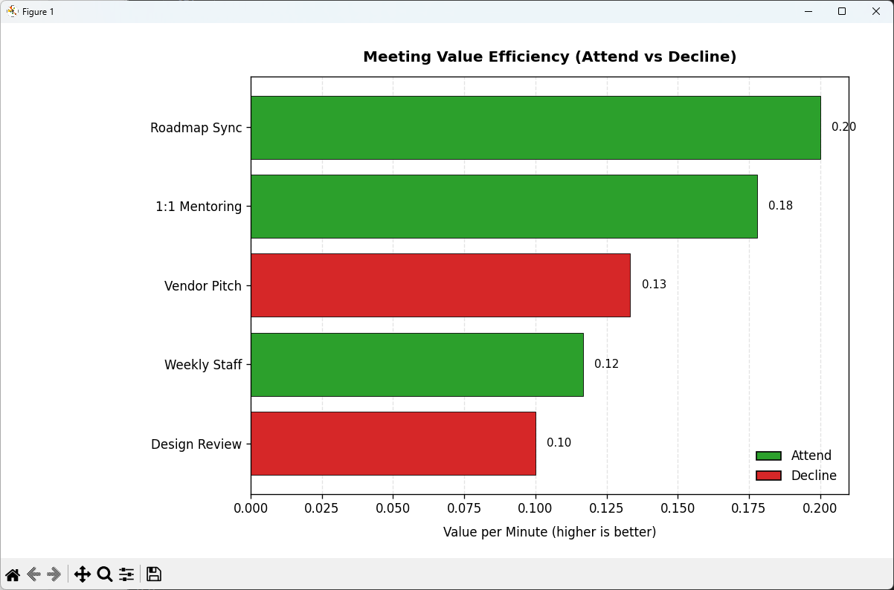

+++
title = "The Meeting Diet: An Optimization Approach to Your Calendar"
date = 2025-08-28T05:00:00-07:00
draft = false
categories = ["AI", "Optimization", "Workplace Productivity"]
tags = ["Knapsack Problem", "Python", "OR-Tools", "Meetings", "AI Prompting"]
listThumb = "meeting-diet.png"
+++

<figure style="float: right; margin: 0 20px 10px 20px; width: 250px; text-align: center;">
  
  <figcaption style="font-size: 0.9em; color: #555; margin-top: 5px;">
    <em>If you don't optimize your schedule, your schedule will optimize you. Badly</em>
  </figcaption>
</figure>


Every week your calendar fills with more meeting invites than you can reasonably handle. Which ones are worth the time and energy, and which should you politely decline? What if there was a way to *quantify* that choice?

---

> *"Your calendar is a knapsack. Every meeting takes space, but only some add enough value to justify carrying them."*

---

**The good news: math can help.** By modeling your schedule as a [**0/1 knapsack problem with two constraints**](https://en.wikipedia.org/wiki/Knapsack_problem#Multi-dimensional_knapsack_problem)
, you can treat meetings like items with value, time cost, and energy cost. Classic optimization techniques then help decide which meetings to attend. In this post, we'll walk through framing the problem, prompting AI to scaffold the code, and running a simulation to visualize your optimal "meeting diet."

<!--more-->

---

## The Thought Experiment

Imagine you have ten meetings on your calendar this week. Each one consumes a certain number of minutes and drains a certain amount of cognitive energy. Some are critical (roadmap syncs, 1:1 mentoring sessions), while others could probably be skipped without much consequence. With products that can summarize any meeting you miss, the real challenge isn't fear of missing out, it's fear of wasting time. Therefore, the question becomes: which meetings earn a place in your week, and which should be left to the AI to summarize?

Now add two constraints:  

- A **time budget** (say, three hours of meetings per week).  
- An **energy budget** (say, ten units of attention before you burn out).  

Your challenge: select the subset of meetings that maximizes total value without breaking either budget.  

This is precisely the **0/1 knapsack problem with two constraints**. The logic is simple, but the combinations can be overwhelming without computational help. That's where optimization libraries and AI to scaffold the boilerplate come in.

## Modeling the Problem

To simulate the problem accurately (but tractably), we make the following simplifications:

**Assumptions:**

- Each meeting has three attributes: `value`, `time`, and `energy`.  
- Meetings are indivisible. You either attend or skip (no partial credit).  
- Time and energy budgets are hard caps (no overdraw allowed).  
- All values are known and deterministic (no surprises this week).  

With these assumptions, our task is to implement a binary decision variable for each meeting and solve a maximization problem subject to dual constraints.

---

## Using AI to Scaffold the Code

To save time, we'll lean on an AI assistant to scaffold the solver code. The trick is to phrase the prompt in terms of optimization jargon (**knapsack**, **ILP**, **constraints**) and be explicit about **inputs/outputs**. For the solver, we'll use **PuLP**, a lightweight open-source Python library for linear and integer programming. It's simple enough for quick experiments like this, yet powerful enough to express dual-constraint knapsack problems cleanly.

**Prompt:**

---

> *Write Python code using PuLP to solve a 0/1 knapsack where each item (meeting) has a value, a time cost, and an energy cost. Maximize value under two constraints: total time <= TIME_BUDGET and total energy <= ENERGY_BUDGET. Return the chosen meetings, total value, and totals for time and energy.*

---

As you can see, this prompt took a little bit of problem-domain knowledge: namely, the mathematics of a 0/1 knapsack with dual constraints. That's the pattern with good prompts: you bake in just enough structure (variables, objective, constraints) so the model knows what to build. From there, you iterate by adding practical details the solver actually needs:

- **Data schema**: specify each meeting's fields (name, value, time, energy), units (minutes), and example rows.

- **Feasibility & edge cases**: what if no solution fits? what if time or energy is zero?

- **Determinism**: ask to print solver status and selected items in a stable order.

- **Output contract**: require totals (value, time, energy) and a compact table for copy/paste.

- **Extensibility**: mention optional constraints (mandatory meetings, conflicts/overlaps) so the code scaffolds for growth.

A stronger, next-iteration prompt might read:

---

> *Write Python code with PuLP to solve a 0/1 knapsack over meetings. Each meeting is a dict with name (str), value (int), time (minutes, int), and energy (int). Maximize total value subject to sum(time) ≤ TIME_BUDGET and sum(energy) ≤ ENERGY_BUDGET. If infeasible, print ‘No feasible selection'. Otherwise, print a sorted table of selected meetings with columns: Name, Value, Time, Energy; and then totals. Include a function solve_meeting_diet(meetings, time_budget, energy_budget) that returns (chosen, total_value, total_time, total_energy), and a main() with 5 sample meetings. Print solver status.*

---

This keeps the math crisp, but adds the engineering guardrails that turn a first-draft script into something you can run, read, and extend.

```python
from pulp import LpProblem, LpMaximize, LpVariable, lpSum, LpBinary

def solve_meeting_diet(meetings, time_budget, energy_budget):
    # Decision variables
    x = {
        m["name"]: LpVariable(cat=LpBinary, name=f"x_{i}")
        for i, m in enumerate(meetings)
    }

    # Model
    model = LpProblem("MeetingDiet", LpMaximize)
    model += lpSum(m["value"] * x[m["name"]] for m in meetings)

    # Constraints
    model += lpSum(
        m["time"] * x[m["name"]] for m in meetings
    ) <= time_budget

    model += lpSum(
        m["energy"] * x[m["name"]] for m in meetings
    ) <= energy_budget

    # Solve
    model.solve()

    # Gather results
    attend = [m for m in meetings if x[m["name"]].value() == 1]
    chosen_names = {m["name"] for m in attend}
    total_value = sum(m["value"] for m in attend)
    total_time = sum(m["time"] for m in attend)
    total_energy = sum(m["energy"] for m in attend)

    return attend, chosen_names, total_value, total_time, total_energy

```

---

## Simulation: Choosing Meetings

Let's run the model and print results. Here we prompt AI to write a simple main() block that reports which meetings were chosen and the totals.

**Prompt:**

---

> *Extend the PuLP meeting diet example by printing the selected meetings and totals for value, time, and energy.*

I took the generated code, added some sample meetings, and ran the script.

```python
def main():
    meetings = [
        {"name": "Weekly Staff",  "value": 7,  "time": 60, "energy": 3},
        {"name": "Design Review", "value": 9,  "time": 90, "energy": 6},
        {"name": "1:1 Mentoring", "value": 8,  "time": 45, "energy": 2},
        {"name": "Vendor Pitch",  "value": 4,  "time": 30, "energy": 2},
        {"name": "Roadmap Sync",  "value": 10, "time": 50, "energy": 4},
    ]

    TIME_BUDGET = 180
    ENERGY_BUDGET = 10

    attend, chosen_names, total_value, total_time, total_energy = (
        solve_meeting_diet(
            meetings,
            TIME_BUDGET,
            ENERGY_BUDGET,
        )
    )

    print("Selected meetings:")
    for m in attend:
        print(
            f" - {m['name']} "
            f"(v={m['value']}, t={m['time']}m, e={m['energy']})"
        )

    print(f"\nTotal value = {total_value}")
    print(f"Total time  = {total_time} minutes")
    print(f"Total energy= {total_energy} units")

```

**Sample Output:**

```java
Result - Optimal solution found

Objective value:                25.00000000
Enumerated nodes:               0
Total iterations:               0
Time (CPU seconds):             0.01
Time (Wallclock seconds):       0.01

Option for printingOptions changed from normal to all
Total time (CPU seconds):       0.03   (Wallclock seconds):       0.03

Selected meetings:
 - Weekly Staff (v=7, t=60m, e=3)
 - 1:1 Mentoring (v=8, t=45m, e=2)
 - Roadmap Sync (v=10, t=50m, e=4)

Total value = 25
Total time  = 155 minutes
Total energy= 9 units
```

---

## Making the Results Visual

<figure style="float: right; margin: 0 20px 10px 20px; width: 400px; text-align: center;">
  
  <figcaption style="font-size: 0.9em; color: #555; margin-top: 5px;">
    <em>Each bar shows a meeting's value-to-time ratio, with green bars marking the meetings attended under the time and energy budgets and red bars marking those declined.</em>
  </figcaption>
</figure>

At first, I asked the AI for a quick visualization. The initial result was a plain vertical bar chart: it technically worked, but it looked generic and wasn't presentation-ready. Specifically, I realized the graph needed to:

- sort meetings by efficiency,
- show labels clearly,
- differentiate attended vs declined with a legend,
- and generally look like something I'd actually show a team.

**Prompt:**

---

> *Using matplotlib, plot a horizontal bar chart of meetings sorted by value-per-minute. Color attended meetings green and declined meetings red. Add a legend, gridlines, and numeric labels at the end of each bar. Use a clear title and make the chart presentation-quality.*

---

```python
def plot_meetings(
    meetings,
    chosen_names,
    title="Meeting Value Efficiency (Attend vs Decline)",
):
    import matplotlib.pyplot as plt
    from matplotlib.patches import Patch

    # Compute value-per-minute ratios (avoid div-by-zero)
    names   = [m["name"] for m in meetings]
    ratios = [
        (m["value"] / m["time"]) if m["time"] else 0.0
        for m in meetings
    ]

    status = [
        "Attend" if m["name"] in chosen_names else "Decline"
        for m in meetings
    ]

    # Sort by ratio (desc) for a cleaner story
    order = sorted(
        range(len(meetings)),
        key=lambda i: ratios[i],
        reverse=True
    )
    names_sorted  = [names[i] for i in order]
    ratios_sorted = [ratios[i] for i in order]
    status_sorted = [status[i] for i in order]

    # Color map
    colors = {"Attend": "#2ca02c",  # green
              "Decline": "#d62728"}  # red
    bar_colors = [colors[s] for s in status_sorted]

    # Figure
    fig, ax = plt.subplots(figsize=(10, 6), dpi=120)
    bars = ax.barh(names_sorted, 
                   ratios_sorted, 
                   color=bar_colors, 
                   edgecolor="black", 
                   linewidth=0.5)

    # Labels & title
    ax.set_xlabel("Value per Minute (higher is better)", labelpad=8)
    ax.set_title(title, pad=12, fontweight="bold")

    # Grid for readability
    ax.xaxis.grid(True, linestyle="--", alpha=0.35)
    ax.set_axisbelow(True)

    # Show values at end of bars
    xmax = max(ratios_sorted) if ratios_sorted else 0.0
    pad = 0.02 * (xmax if xmax > 0 else 1.0)
    for bar, r in zip(bars, ratios_sorted):
        ax.text(bar.get_width() + pad, bar.get_y() + bar.get_height()/2,
                f"{r:.2f}", va="center", ha="left", fontsize=9)

    # Legend
    legend_handles = [
        Patch(
            facecolor=colors["Attend"],
            edgecolor="black",
            label="Attend",
        ),
        Patch(
            facecolor=colors["Decline"],
            edgecolor="black",
            label="Decline",
        ),
    ]

    ax.legend(
        handles=legend_handles,
        frameon=False,
        loc="lower right",
    )

    # Invert y to have highest ratio on top
    ax.invert_yaxis()

    # Tight layout; extra space for long labels
    plt.tight_layout()
    plt.subplots_adjust(left=0.28, right=0.95, top=0.9, bottom=0.12)
    plt.show()

```

---

## What We Learned

By modeling your calendar as a knapsack, you can quantify trade-offs instead of relying on gut feel. We also learned how to craft precise AI prompts that generate optimization code, and how to refine those prompts to add reporting and visualization. The big win: you now have a framework for saying no with math.

---

## Exercises for the Reader

Ready to push this further? Try these extensions:

### Beginner Level: Quick Fixes & Calibration

- **Mandatory meetings:** Add a constraint that Weekly Staff must always be selected.

- **Budget tuning:** Run the model with TIME_BUDGET = 120, 180, 240 and see how choices shift.

- **Energy-only mode:** Ignore time constraint; see which meetings blow up your energy budget first.

---

### Intermediate Level: Geometry & Body Modeling

- **Overlaps:** Add a constraint to forbid selecting two meetings that overlap in time.

- **Daily limits:** Add a rule like “no more than 2 hours of meetings per day.”

- **Context switching:** Penalize picking too many short meetings.

---

### Advanced Level: Environment & Stochasticity

- **Uncertain values:** Sample meeting values from a probability distribution (e.g., Normal).

- **Monte Carlo:** Run 100 simulations of random meeting values and see which meetings are most often chosen.

- **Multi-objective optimization:** Balance value against “fatigue penalty” explicitly.

---

## Final Thoughts

Meetings don't have to consume your week. With a little optimization, you can put your calendar on a diet that actually helps you get healthier at work. To paraphrase the old expression, **run your calendar, or your calendar will run you**.

---

## Try It Yourself

[Download the full code on GitHub](https://github.com/TomArcher/technical-blog-examples/tree/main/python/meeting-diet)