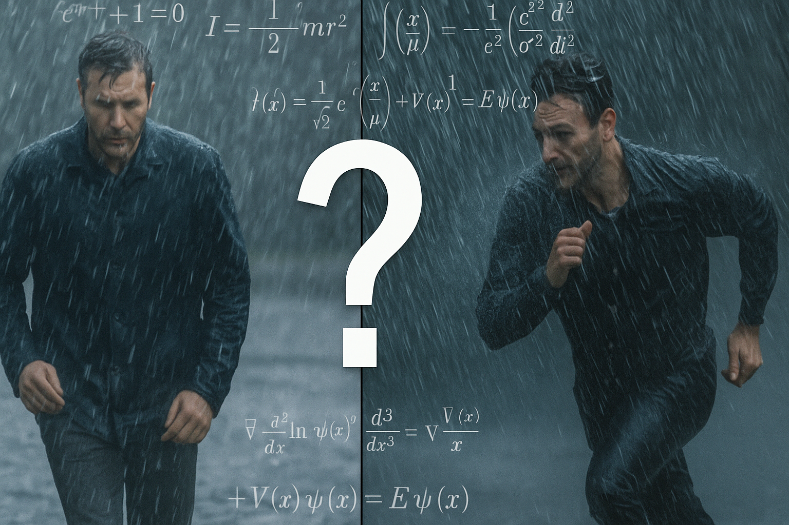

+++
title = "Should You Walk or Run in the Rain? The Puzzle That Sparked a Passion"
date = '2025-08-18T09:00:00-07:00'
draft = false
categories = ["Programming", "Modeling", "AI"]
tags = [
  "Python",
  "Generative AI",
  "Prompt Engineering",
  "Modeling",
  "Physics",
  "Rain",
  "Geometry",
  "Matplotlib"
]
listThumb = "rain-paradox.png"
+++

<figure style="float: right; margin: 0 20px 10px 20px; width: 250px; text-align: center;">
  
  <figcaption style="font-size: 0.9em; color: #555; margin-top: 5px;">
    <em>To walk or to run. That is the question.</em>
  </figcaption>
</figure>

Early in my programming career, I came across a coding challenge that stuck with me for many years:

---

> *"If it's raining, will you stay drier by walking or running through it?"*

---

At the time, I didn't have the skillset or tools to simulate the problem properly. It became one of the first exercises that nudged me toward a lifelong fascination with modeling the real world through code. The problem wasn't about recursion or memory management. It was about **getting wet**, and **how fast you move through falling rain**.

---

## The Thought Experiment

Imagine you're 500 feet from shelter. It's raining. No umbrella.
You have two options:

- **Walk** - exposes you to more rain from above.
- **Run** - reduces vertical exposure but increases the number of raindrops hitting your front.

Which gets you wetter?

The paradox lies in competing intuitions:

- More time in rain = more wetness.
- Moving faster = more frontal exposure.

What made this problem compelling was that there wasn’t an obvious answer and no way (back then) to definitively prove which effect dominated. It was a thought experiment we debated endlessly with hand-waving.

But now, with Python, generative AI, and a (virtual) rainy afternoon to spare, I can finally simulate this problem to **know the answer**.

## Modeling the Rain

To simulate the problem accurately (but tractably), we make the following simplifications:

**Assumptions:**

- Rain falls vertically at a constant rate (no wind).
- Rain falls vertically at a uniform density.
- You're a rectangular block moving at constant speed.
- Getting wet = the number of raindrops hitting you from the top and the front.
- Rain hits the top based on time exposed, and the front based on distance traveled.
- Rain from behind and sides is ignored.

This converts the real-world complexity into a discrete physical model driven by surface area, velocity, and time.

## Using AI to Generate the Simulation

Instead of starting from scratch, I begin by asking a generative AI model to help scaffold the solution.

```prompt
Write a Python simulation to model how wet a person gets in the 
rain depending on their walking or running speed. Assume a 
person is a rectangular block with a top area and front area. 
Rain falls vertically at a steady rate. Calculate drops hitting 
the top (time exposed) and front (distance traveled).
```

The model produces a solid draft. As with most AI-generated code, it needs refinements, such as naming consistency, unit correctness, and clearer abstractions. But that initial generation saved me from boilerplate and gave me a starting point. What follows is the refined version.

```python
from dataclasses import dataclass
import math

@dataclass(frozen=True)
class Person:
    height_feet: float
    shoulder_width_feet: float
    depth_feet: float

    @property
    def top_area_sqft(self) -> float:
        return self.shoulder_width_feet * self.depth_feet

    @property
    def front_area_sqft(self) -> float:
        return self.height_feet * self.shoulder_width_feet


@dataclass(frozen=True)
class Rain:
    intensity_drops_per_sqft_s: float  # drops / ft^2 / s
    fall_speed_ft_s: float             # ft / s


def intensity_from_inches_per_hour(
    rainfall_inches_per_hour: float,
    drop_diameter_mm: float = 2.0
) -> float:
    # Convert rainfall (in/hr) to intensity (drops/ft^2/s)
    depth_flux_ft_per_s = (
        (rainfall_inches_per_hour / 12.0) / 3600.0
    )
    drop_diameter_ft = (
        (drop_diameter_mm / 1000.0) * 3.28084
    )
    drop_radius_ft = drop_diameter_ft / 2.0
    drop_volume_cuft = (
        (4.0 / 3.0) * math.pi * (drop_radius_ft ** 3)
    )
    return depth_flux_ft_per_s / drop_volume_cuft


def simulate_wetness(
    speed_ft_s: float,
    distance_feet: float,
    person: Person,
    rain: Rain
) -> float:
    """
    Wetness = intensity * top_area * (distance / speed)
            + (intensity / fall_speed) * front_area * distance
    """
    if speed_ft_s <= 0:
        raise ValueError("Speed must be positive")

    intensity = rain.intensity_drops_per_sqft_s
    fall_speed = rain.fall_speed_ft_s
    top_area = person.top_area_sqft
    front_area = person.front_area_sqft

    from_above = (
        intensity * top_area * (distance_feet / speed_ft_s)
    )
    from_front = (
        (intensity / fall_speed) * front_area * distance_feet
    )
    return from_above + from_front
```

## Simulating the Tradeoff: Walking vs. Running

Here, I used AI again. I asked it to *extend* the simulation with a loop that tested speeds from walking pace up to sprinting. The prompt was short:

```prompt
Using the simulate_wetness function, generate Python code to loop over
a list of speeds (ft/s) and print out the resulting wetness.
```

The model produces usable code that I edit for clarity and readability.

```python
from typing import List

# Person (~5'10" tall; ~20" shoulder width; ~12" depth)
person = Person(
    height_feet=70/12,
    shoulder_width_feet=20/12,
    depth_feet=12/12
)

# Example rain: 0.2 in/hr, ~2 mm drops, ~20 ft/s fall speed
intensity = intensity_from_inches_per_hour(
    0.2, drop_diameter_mm=2.0
)
rain = Rain(
    intensity_drops_per_sqft_s=intensity,
    fall_speed_ft_s=20.0
)

# Define a list of speeds in feet per second.
speeds_ft_s: List[float] = [3.3, 5.5, 8.8, 13.2]
distance_feet: float = 500.0  # Arbitrary test distance (ft)

# Compute wetness values for each speed
wetness_values: List[float] = [
    simulate_wetness(
        speed, distance_feet, person, rain
    )
    for speed in speeds_ft_s
]

# Iterate over speeds and their corresponding wetness values.
for speed, wetness in zip(speeds_ft_s, wetness_values):
    print(
        f"Speed: {speed:.1f} ft/s -> "
        f"Wetness: {int(wetness)} drops"
    )
```

**Sample Output:**

The following sample output shows that the trend is clear: faster movement reduces overall wetness, but with diminishing returns.

```output
Speed: 3.3 ft/s -> Wetness: 15510 drops
Speed: 5.5 ft/s -> Wetness: 12348 drops
Speed: 8.8 ft/s -> Wetness: 10570 drops
Speed: 13.2 ft/s -> Wetness: 9582 drops
Speed: 30.0 ft/s -> Wetness: 8476 drops
```

## Making the Results Visual

For visualization, I didn’t ask AI to just "plot it." Instead, I prompted:

```prompt
Add a matplotlib function that plots wetness vs. speed, including
a horizontal asymptote for the minimum frontal-only exposure.
```

This prompt yields the basis of the plotting function below, which I then fine-tune by adjusting labels, colors, and legend placement.

```python
from typing import List
import matplotlib.pyplot as plt

def plot_wetness_vs_speed(
    speeds_ft_s: List[float],
    wetness_values: List[float],
    person: Person,
    rain: Rain,
    distance_feet: float
) -> None:
    # Frontal-only asymptote (independent of speed)
    intensity = rain.intensity_drops_per_sqft_s
    fall_speed = rain.fall_speed_ft_s
    frontal_limit = (
        (intensity / fall_speed) *
        person.front_area_sqft *
        distance_feet
    )

    plt.figure(figsize=(8, 5))
    plt.plot(
        speeds_ft_s,
        wetness_values,
        marker='o',
        linestyle='-',
        color='blue',
        label='Total wetness'
    )
    plt.axhline(
        frontal_limit,
        color='crimson',
        linestyle='--',
        label='Frontal-only limit (as speed→∞)'
    )

    plt.title("Wetness vs. Speed in Rain")
    plt.xlabel("Speed (feet per second)")
    plt.ylabel("Total Raindrops (expected)")
    plt.grid(True)
    plt.xticks(speeds_ft_s)
    plt.legend()
    plt.tight_layout()
    plt.show()
```


## The Verdict

**Running gets you less wet, consistently.** The longer you spend under the rain, the more water lands on your head and shoulders. By running, you reduce that exposure time, which significantly cuts down on the amount of rain hitting you from above.

However, there's a tradeoff. As you speed up, you collide with more raindrops from the front. At first, the gains from reduced top-down exposure far outweigh the cost of increased frontal hits. But as your speed continues to climb, you start to hit a point of diminishing returns: you're still getting wetter from the front, and there's less time savings left to gain. No matter how fast you go, you'll always collide with some rain from the front, but you can reduce how long rain hits you from above.

## Exercises for the Reader

When I started writing books, an old friend of mine joked that technical
authors often cover the basics while leaving the more difficult problems as
an *"exercise for the reader.*"

In that same spirit, here are some ideas to extend this rainy-day simulation.
They're grouped into levels, from easy tweaks to more advanced experiments that add realism or mathematical depth.

**Pro tip:** Try phrasing each extension idea as an AI prompt. For example:
"Modify the simulation to treat the person as a cylinder instead of a block."
Then, refine the AI's output to ensure it matches the math.

### Beginner Level: Quick Fixes & Calibration

1. **Unit check:** Verify that each term in the wetness equation resolves 
   to "drops." Work through the dimensional analysis: intensity is in 
   drops/ft²/s, areas are in ft², distances are in ft, and speeds are in 
   ft/s. Making sure these cancel properly is a good exercise in unit 
   consistency.  
1. **Real rainfall:** Let the user input rainfall in inches/hour 
   (e.g., 0.1, 0.5, 1.0). Convert this to drops/ft²/s using the helper 
   function and an assumed drop diameter. Compare light drizzle vs. heavy 
   downpour to see how much the totals scale.  

1. **Validation:** Add input checks to ensure negative speeds or distances 
   can’t be passed into `simulate_wetness`. You could raise exceptions with 
   clear error messages or clamp inputs to realistic ranges. Try testing with 
   edge cases like `speed=0` or `distance=0` to confirm behavior.  

---

### Intermediate Level: Geometry & Body Modeling

1. **Cylindrical person:** Replace the box model with a cylinder (height, 
   radius). Compute the top area as πr² and the front area as height × 2r. 
   Compare wetness outcomes from this smoother shape versus the rectangular 
   one, and discuss which feels more realistic.  
1. **Hunch angle:** Add a tilt angle that decreases top area and increases 
   frontal area. You can use simple trigonometry to project the areas based 
   on the angle. Plotting wetness across different posture angles could 
   reveal the "best" stance in the rain.  
1. **Variable distance:** Run scenarios at 50, 200, 500, and 1000 ft to see 
   how distance affects strategy. Short distances might not justify sprinting, 
   while long distances magnify the benefits. Make a table or plot that 
   compares these cases.  

---

### Advanced Level: Environment & Stochasticity

1. **Wind:** Add a horizontal wind component. Now raindrops fall at an angle 
   (vector \((u, 0, -fall\_speed)\)), so the effective frontal area changes. 
   This turns the simple vertical model into a 3D vector problem. You’ll see 
   that wind can make running sideways into the rain much worse.  
1. **Monte Carlo rain:** Instead of continuous flux, simulate drops randomly 
   with a Poisson process in space-time. Each drop has a chance of hitting 
   the person’s projected area. Run many trials and average the results to 
   approximate the analytic model. This adds randomness to the story.  
1. **Drop size distribution:** Sample raindrop diameters from a realistic 
   distribution (meteorology papers often use log-normal). Larger drops carry 
   more volume and can be weighted more heavily in the wetness score. Try 
   mixing small drizzle with a few large drops to see how totals shift.  

---

## Why I Chose This as My First Post

This problem isn't just about physics or weather. It's about thinking like a programmer, and today, **thinking like a programmer includes understanding how to use AI effectively**.

Yesterday, we memorized programming patterns. Today, we craft AI prompts, evaluate the generated code, and adapt it to real-world needs. The skills are different, but the spirit of curiosity and modeling remains the same.

Over the past many years, that mindset of modeling uncertainty, isolating variables, and iterating toward insight has shaped everything from how I write software, author technical content, and how I approach AI and automation today.

If you enjoyed this, stay tuned. I'll be sharing insights on solving similar puzzles, Python programming, AI prompting, OpenAI, MCP servers, and LLMs.

## Try It Yourself

[Download the full code on GitHub](https://github.com/TomArcher/technical-blog-examples/tree/main/python/rain-paradox)
