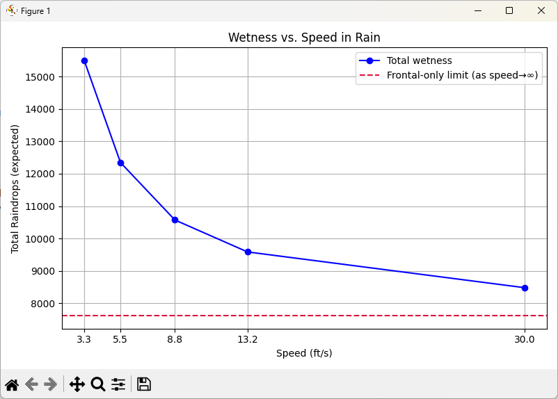

+++
title = "Should You Walk or Run in the Rain? The Puzzle That Sparked a Passion"
date = 2025-08-04T09:00:00-07:00
draft = false
categories = ["Programming", "Modeling"]
tags = [
  "Python",
  "Modeling",
  "Physics",
  "Rain",
  "Weather",
  "Optimization",
  "Geometry",
  "Matplotlib",
  "Visualization",
  "Thought Experiment"
]
+++

Early in my programming career, I came across a programming problem that stuck with me for many years:

---

> *“If it's raining, will you stay drier by walking or running through it?”*

---

At the time, I didn’t have the skills to simulate the problem properly. It became one of the first exercises that nudged me toward a lifelong fascination with modeling the real world through code. The problem wasn’t about recursion or memory management. It was about **getting wet**, and **how fast you move through falling rain**.

---

### The Thought Experiment

Imagine you're 500 feet from shelter. It’s raining. No umbrella.
You have two options:

* **Walk** - exposes you to more rain from above.
* **Run** - reduce vertical exposure but increase the number of raindrops hitting your front.

Which gets you wetter?

The paradox lies in competing intuitions:
- More time in rain = more wetness.
- Moving faster = more frontal exposure.

What made this problem compelling was that there wasn’t an obvious answer — and no way (back then) for me to definitively prove my intuition one way or the other. It was a thought experiment we debated with intuition and hand-waving

But now, with Python and a (virtual) rainy afternoon to spare, I can finally simulate it for real in a few minutes.

---

### Modeling the Rain

To simulate the problem accurately (but tractably), we make the following simplifications:

#### Assumptions:

* Rain falls vertically at a constant rate (no wind).
* Rain falls vertically at a uniform density.
* You’re a rectangular block moving at constant speed.
* Getting wet = the number of raindrops hitting you from the **top** and the **front**.
* Rain hits the top based on **time exposed**, and the front based on **distance** traveled.
* Rain from behind and sides is ignored.

This converts the real-world complexity into a **discrete physical model** driven by surface area, velocity, and time.

---

### Python Simulation

To better understand the rain exposure at different speeds, we can model the problem in Python. This function estimates how many raindrops hit your body while walking or running, based on your speed, body dimensions, and distance to shelter. It works by calculating how much rain hits a person from two directions: above and in front.

```python
def simulate_wetness(speed_ft_s: float, distance_ft: float, rain_density:int = 1000) -> float:
    """
    Calculates total 'wetness' (raindrops hitting the body) for a given speed.

    Parameters:
    - speed_ft_s: speed in feet per second
    - distance_ft: distance to shelter in feet
    - rain_density: raindrops per square foot per second

    Returns:
    - total number of raindrops that hit the body
    """
    # Human body dimensions (tested with random values).
    height = 70 / 12     # in feet (5'10")
    width = 20 / 12      # in feet (should width)
    depth = 12 / 12      # in feet (body depth)

    # Time exposed to rain (in seconds).
    time_in_rain = distance_ft / speed_ft_s

    # Surface areas exposed.
    top_area = width * depth     # Head and shoulders.
    front_area = height * width  # Chest and legs.

    # Calculate rain impact.
    rain_from_above = rain_density * top_area * time_in_rain
    rain_from_front = rain_density * front_area * distance_ft

    # Total wetness from above and front.
    return rain_from_above + rain_from_front
```

---

### Simulating the Tradeoff: Walking vs. Running

To see how speed affects how wet you get, let’s run some simulations at a few different movement speeds. We'll run the function for values representing a slow walk at 2.25 mph all the way up to a full sprint at 9 mph. The values printed represent the total number of raindrops that hit you at each speed.

```python
# Define a list of speeds in feet per second.
speeds: List[float] = [3.3, 5.5, 8.8, 13.2]
distance: int = 328  # Arbritrary value to test with.

# Compute wetness values for each speed
wetness_values: List[float] = [simulate_wetness(speed, distance) for speed in speeds]

# Iterate over speeds and their corresponding wetness values.
for speed, wetness in zip(speeds, wetness_values):
    # Print the speed and its associated wetness.
    print(f"Speed: {speed:.1f} ft/s -> Wetness: {int(wetness)} drops")

```

---

**Sample Output:**

After running the simulation, we can now see how wetness changes with each increase in speed. As expected, the longer you spend in the rain, the more drops accumulate on your head and shoulders. But running faster also means more drops hit you from the front. The balance between those two effects is captured in the following numbers:

```
Speed: 3.3 ft/s -> Wetness: 68333 drops
Speed: 5.5 ft/s -> Wetness: 54000 drops
Speed: 8.8 ft/s -> Wetness: 46500 drops
Speed: 13.2 ft/s -> Wetness: 43333 drops
```

As you can see, the trend is clear: faster movement reduces overall wetness, but with diminishing returns.


---

### Making the Results Visual

Now, let’s turn the data into a graph so we can better visualize the relationship between speed and total wetness. This plot will show how the number of raindrops hitting you changes as your speed increases:

```python
from typing import List
import matplotlib.pyplot as plt

def plot_wetness_vs_speed(speeds: List[float], wetness_values: List[float]) -> None:
    """
    Plots wetness vs. speed using matplotlib.

    Parameters:
    - speeds: list of speeds (in feet/second)
    - wetness_values: list of corresponding wetness values
    """
    # Create a new figure with a specified size (width=8", height=5").
    plt.figure(figsize=(8, 5))

    # Plot speed vs. wetness as a blue line with circular markers.
    plt.plot(speeds, wetness_values, marker='o', linestyle='-', color='blue')

    # Add a title to the chart.
    plt.title("Wetness vs. Speed in Rain")

    # Label the x-axis and y-axis.
    plt.xlabel("Speed (feet per second)")
    plt.ylabel("Total Raindrops Hit")

    # Add a grid for better readability.
    plt.grid(True)

    # Use the actual speed values as x-axis ticks.
    plt.xticks(speeds)

    # Automatically adjust layout to prevent clipping.
    plt.tight_layout()

    # Display the plot window.
    plt.show()

```



### The Verdict

**Running gets you less wet**, consistently. The longer you spend under the rain, the more water lands on your head and shoulders. By running, you reduce that exposure time, which significantly cuts down on the amount of rain hitting you from above.

However, there’s a tradeoff. As you speed up, you collide with more raindrops from the front. At first, the gains from reduced top-down exposure far outweigh the cost of increased frontal hits. But as your speed continues to climb, you start to hit a point of diminishing returns: you’re still getting wetter from the front, and there’s less time savings left to gain. No matter how fast you go, you'll always collide with some rain from the front, but you can reduce how long rain hits you from above.

This result holds under idealized assumptions with no wind, dodging puddles, or slipping. But the model teaches us something deeper: **some problems can only be truly understood when you take the time to simulate them**.

---

### Why I Chose This as My First Post

This problem isn’t just about physics or weather. It’s about **thinking like a programmer**, and using code to test what your intuition can’t fully resolve.

Over the past many years, that mindset of modeling uncertainty, isolating variables, and iterating toward insight has shaped everything from how I write software, author technical content, and how I approach AI and automation today.

If you enjoyed this, stay tuned. I’ll be sharing insights on solving similar puzzles, Python programming, AI prompting, OpenAI, and LLMs.

---

### Try It Yourself

[Download the full code on GitHub](rain-paradox.py)
