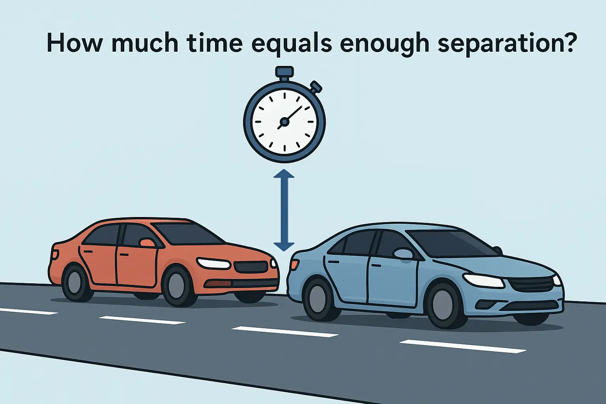
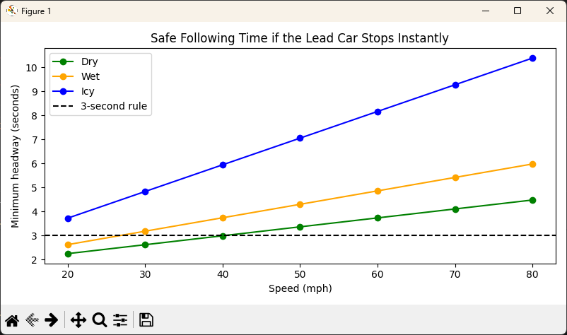

+++
title = "Rethinking the Three-Second Traffic Rule: When Physics Says It’s Not Enough"
date = "2025-10-23T09:00:00-07:00"
draft = false
categories = ["Applied Modeling & Simulation"]
tags = ["physics", "Python", "simulation", "kinematics"]
author = "Tom Archer"
listThumb = "safe-distance-in-traffic.png"
+++

<figure style="float: right; margin: 0 20px 10px 20px; width: 250px; text-align: center;">
  
  <figcaption style="font-size: 0.9em; color: #555; margin-top: 5px;">
    <em>Following distance isn't just space, it's time in motion.</em>
  </figcaption>
</figure>

While researching why car insurance rates are so extremely high in Las Vegas, I started thinking about the **three-second rule** and its validity. As I've always heard, the three-second rule refers to how far you should be behind a car in traffic. The idea is that you pick out a fixed roadside marker and you are supposed to pass that marker at least three seconds after the car in front of you. That rule is simple enough, yet deceptively deep once you unpack the physics.

---

> *"Three seconds is a rule of thumb. Physics reveals the truth."*

---

<!--more-->

I have always found that kind of rule fascinating because it is both universal and situational. It works whether you are cruising at 25 mph through town or flying down I-5 at 75 mph. At least, that is what the driver's manuals claim. But how does it hold up when you actually model two cars in motion: one stopping suddenly, the other reacting with a delay? That is where the math and a little Python simulation come in.

## The Thought Experiment

Imagine two cars traveling in a straight line, one following the other at highway speed. The lead car doesn't just brake; it **comes to an immediate stop** after colliding with another vehicle or barrier. The following driver has no warning and can only react after realizing what happened and pressing the brakes. The question now becomes: how much **time headway** (in seconds) does that driver need to avoid becoming the second or even third car in a chain-reaction crash?

This scenario is far harsher than the standard "braking distance" example you see in driver's ed. When the lead car stops instantly, there's no gradual deceleration, no brake lights glowing in time to react; there's just physics and the driver's delay. In this version, reaction time dominates everything. Every tenth of a second eats up more road, and if the following car's tires or brakes aren't perfect, even three seconds might not be enough.

---

## Modeling the Problem

To make the problem solvable, we model the leader's **instantaneous stop** as having zero forward motion after time zero, while the follower continues at a constant speed until reaction time elapses, then brakes at a fixed deceleration rate.

**Assumptions:**

1. Both cars are traveling at the same initial speed.
2. The leader stops completely at time zero (no deceleration ramp).
3. The follower continues at full speed during the reaction delay, then begins braking at a constant rate.
4. The goal is to find the minimum headway time (in seconds) or distance (in feet) needed to prevent impact.

The follower's stopping distance is given by the classic kinematic equation:

\\[
d_F = v\tau + \frac{v^2}{2a_F}
\\]

where:

- \\(v\\) = initial speed (ft/s)
- \\(\tau\\) = reaction time (s)
- \\(a_F\\) = follower's braking deceleration (ft/s²)

Since the leader's distance to a stop is zero (it's already stationary), the **minimum initial gap** must be at least \\(d_F\\), which translates directly into **headway time** by dividing by the initial velocity:

\\[
h \ge \tau + \frac{v}{2a_F}
\\]

This model is intentionally severe because the lead car contributes nothing to braking. The follower alone must cover the entire stopping distance.

---

## Using AI to Scaffold the Code

You can still ask an AI assistant to generate the helper functions, but now the prompt needs to describe the **instant-stop leader scenario**, where only the follower decelerates.

**Prompt example:**

> Define a constant `MPH_TO_FTS = 1.4666666667`and implement three functions:
> 1. `mph_to_fts(mph: np.ndarray | float) -> np.ndarray`: converts mph to ft/s, accepts scalar or arraylike, and returns `np.asarray(mph, dtype=float) * MPH_TO_FTS`.
> 2. `required_headway_instant_stop(v_mph: np.ndarray | float, tau: float = 1.5, a_f: float = 19.7) -> np.ndarray`: computes the minimum time headway (seconds) to avoid collision if the lead car stops instantly, using `h = tau + v/(2*a_f)` where `v` is in ft/s.
> 3. `print_headway_table(speeds_mph: Iterable[float], conditions: Dict[str, float], tau: float = 1.5) -> None`: prints a table of required headway for each condition and speed, using formatted output like `"{mph:>3.0f} mph → {h:.2f} s"`.
>
> Use clear docstrings, vectorized math, and match standard Python formatting and type hints exactly. Output only the Python code.

**Python code**:
```python
from __future__ import annotations
import numpy as np
from typing import Dict, Iterable, Tuple

MPH_TO_FTS = 1.4666666667

def mph_to_fts(mph: np.ndarray | float) -> np.ndarray:
    """Convert mph to ft/s. Accepts scalar or arraylike."""
    v = np.asarray(mph, dtype=float)
    return v * MPH_TO_FTS

def required_headway_instant_stop(
    v_mph: np.ndarray | float,
    tau: float = 1.5,
    a_f: float = 19.7
) -> np.ndarray:
    """
    Minimum time headway (seconds) to avoid collision if the 
    lead car stops instantly. h = tau + v/(2*a_f), where v is 
    initial speed in ft/s and a_f is follower decel in ft/s^2.
    Accepts scalar or arraylike mph and returns ndarray.
    """
    v_fts = mph_to_fts(v_mph)
    return tau + v_fts / (2.0 * a_f)

def print_headway_table(
    speeds_mph: Iterable[float],
    conditions: Dict[str, float],
    tau: float = 1.5
) -> None:
    """
    Print a simple table of required headway by condition 
    and speed.
    """
    speeds = list(speeds_mph)
    for name, a_f in conditions.items():
        print(f"\n{name} pavement:")
        for mph in speeds:
            h = required_headway_instant_stop(mph, tau=tau, a_f=a_f)
            print(f"  {mph:>3.0f} mph \u2192 {h:.2f} s")

```

---

## Simulation: Comparing Road Conditions

Now we can simulate how road conditions (dry, wet, icy) affect the safe following time **if the car ahead stops dead**.

**Prompt example:**

> Implement a `main` function that defines a speeds table list that contains the elements 30, 50, 70. Define a table conditions dictionary to hold the driving conditions (key) and its deceleration default (value). The values are "Dry" (19.7), "Wet" (13.1"), and "Icy" (6.6). Finally, call the `print_headway_table` function passing it the speeds table list, the table conditions dictionary, and a tau value of 1.5.

**Python code**
```python
def main() -> None:
    # Headway at a few representative speeds
    speeds_table = [30, 50, 70]

    # Deceleration assumptions in ft/s^2
    # Print table uses simple dict[name] = a_f
    table_conditions = {
        "Dry": 19.7,
        "Wet": 13.1,
        "Icy": 6.6,
    }
    print_headway_table(speeds_table, table_conditions, tau=1.5)
```

**Sample Output:**

The following output tells us the **minimum time gap needed to avoid a collision** under each condition (Dry, Wet, Icy) at those speeds (30, 50, 70), given the model's assumptions. A quick read tells us that, even at moderate speeds, the difference is dramatic. A three-second gap feels generous in dry weather but terrifyingly short when the road turns slick.

```yaml
✨ Dry pavement:
30 mph → 2.62 s
50 mph → 3.36 s
70 mph → 4.11 s

😬 Wet pavement:
30 mph → 3.18 s
50 mph → 4.30 s
70 mph → 5.42 s

😱 Icy pavement:
30 mph → 4.83 s
50 mph → 7.06 s
70 mph → 9.28 s
```

---

## Making the Results Visual

<figure style="float: right; margin: 0 20px 10px 20px; width: 400px; text-align: center;">
  
  <figcaption style="font-size: 0.9em; color: #555; margin-top: 5px;">
    <em>Time-based following rules scale with speed, but the coefficient of friction between the tires and the road and the driver's reaction time set the real safety margin.</em>
  </figcaption>
</figure>

A plot brings this vividly to life: three upward curves showing how the safe following time rises sharply with speed, and exponentially with slipperiness. The dashed "3-second rule" line slices through them, safe in good weather but hopeless on ice.

**Prompt:**

> Write Python code that plots the minimum safe following time versus speed for several road conditions when the lead car stops instantly. Assume there is a helper named required_headway_instant_stop(speeds_mph, tau, a_f) that accepts a scalar or array of speeds in mph and returns headway in seconds. Create a function called plot_headway_curves that:
> - Accepts an iterable of speeds in mph and a dict of conditions where each key is a label like Dry or Wet and each value is a tuple (a_f, color) with a_f in ft/s^2 and a valid Matplotlib color.
> - Has optional parameters for the reaction time tau, a horizontal rule in seconds to compare against, and a title string.
> - Uses NumPy to turn the speeds into a float array.
> - For each condition computes headway for all speeds and plots a line with markers, one line per condition.
> - Draws a dashed horizontal line at the chosen rule level in seconds.
> - Labels axes with Speed (mph) and Minimum headway (seconds), adds a legend, applies a tight layout, and shows the figure.
>
> Keep the implementation compact and readable. Import Matplotlib inside the function. Use reasonable defaults like tau around 1.5 seconds and a 3 second rule line. Do not include any file I/O or CLI parsing. Output only the Python code.

**Python code:**
```python
def plot_headway_curves(
    speeds_mph: Iterable[float],
    conditions: Dict[str, Tuple[float, str]],
    tau: float = 1.5,
    rule_sec: float = 3.0,
    title: str = (
        "Safe Following Time if the Lead Car Stops Instantly"
    ),
) -> None:
    """
    Plot headway vs speed for multiple road conditions.

    conditions: dict like
    {"Dry": (19.7, "green"), "Wet": (13.1, "orange"), ...}
    speeds_mph: iterable of speeds in mph
    """
    import matplotlib.pyplot as plt

    speeds = np.asarray(list(speeds_mph), dtype=float)

    plt.figure(figsize=(8, 4))
    for name, (a_f, color) in conditions.items():
        h = required_headway_instant_stop(
            speeds, tau=tau, a_f=a_f
        )
        plt.plot(speeds, h, "o-", color=color, label=name)

    plt.axhline(
        rule_sec,
        color="black",
        ls="--",
        label=f"{rule_sec:.0f}-second rule",
    )
    plt.xlabel("Speed (mph)")
    plt.ylabel("Minimum headway (seconds)")
    plt.title(title)
    plt.legend()
    plt.tight_layout()
    plt.show()
```

Insert the following code at the bottom of the `main` function to call the `plot_headway_curves` function:

```python
# Smoother range for plotting
speeds_plot = np.linspace(20, 80, 13)

# Plotting uses dict[name] = (a_f, color)
plot_conditions = {
    "Dry": (19.7, "green"),
    "Wet": (13.1, "orange"),
    "Icy": (6.6, "blue"),
}
plot_headway_curves(speeds_plot, plot_conditions, tau=1.5, rule_sec=3.0)
```

---

## What We Learned

When you model an **instant-stop collision**, the "three-second rule" starts looking dangerously optimistic. Reaction time, not braking force, becomes the real bottleneck. Even at 50 miles per hour, a delay of just one extra second can translate into nearly 75 feet of forward motion before your brakes even engage. That's the length of five car lengths gone in an eye blink. The math lays it bare: once the car ahead stops cold, you're not fighting the brakes; you're fighting time itself. It's a sobering reminder that safety margins are rarely about skill or confidence but about how fast physics cashes the checks our reflexes can't cover.

---
