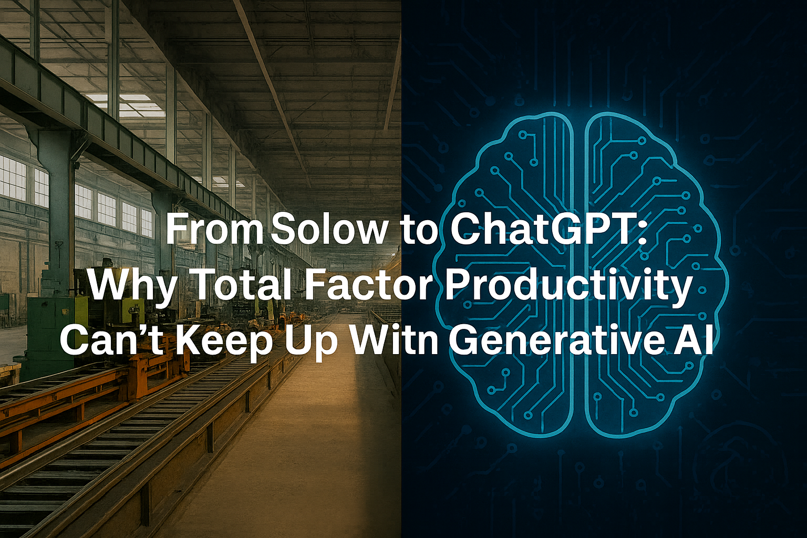

+++
date = '2025-08-19T09:00:00-07:00'
draft = true
title = "From Solow to ChatGPT: Why Total Factor Productivity Can't Keep Up With Generative AI"
categories = ["AI", "Economics", "Productivity"]

tags = [
  "Generative AI",
  "Total Factor Productivity",
  "TFP",
  "Economic Growth",
  "Measurement",
]
listThumb = "tfp-chatgpt.png"
+++

<figure style="float: right; margin: 0 20px 10px 20px; width: 250px; text-align: center;">
  
  <figcaption style="font-size: 0.9em; color: #555; margin-top: 5px;">
    <em>Our tools for measuring progress were built for factories, not for AI.</em>
  </figcaption>
</figure>

If ChatGPT can write code, summarize legal briefs, and help draft business strategies in seconds, why doesn't that show up in our productivity statistics?

Economists have long relied on a metric called **Total Factor Productivity (TFP)** to measure technological progress. But in an era of free digital tools and generative AI, TFP looks more like a rearview mirror than a windshield. It tells us a lot about the past, but almost nothing about where the economy is headed.

---

## What TFP Was Supposed to Do

In 1957, economist Robert Solow, who would later win the Nobel Prize, developed TFP as a way to explain growth. Labor and capital only get you so far. The rest - the mysterious "residual" - was attributed to technological progress. For decades, TFP became the gold standard for measuring how much technology boosts efficiency.

The logic was simple: if the economy was producing more output without more workers or machines, technology must be the difference.

But that was a world of assembly lines, not AI copilots.

---

## Why TFP Struggles With Modern Technology

Critics have been pointing out TFP's flaws for years, and their arguments ring even louder in the age of AI:

* **It ignores embodied technology.** Many innovations are baked into capital goods (think semiconductors or cloud infrastructure). TFP doesn't see them until much later.
* **It misses free digital tools.** Google Maps saves millions of driving hours a day — but because it's free, it barely registers in GDP or TFP.
* **It oversimplifies complex tech.** New technologies often require training, adaptation, or infrastructure before their benefits materialize. TFP flattens these dynamics.

Generative AI checks all three boxes. It lives in the cloud, is often free or cheap to use, and reshapes workflows in ways that are hard to quantify.

---

## Generative AI as the Productivity Paradox 2.0

We've been here before. In the 1980s, economist Robert Solow famously quipped, *"You can see the computer age everywhere but in the productivity statistics."*

Today, swap "computer" for "ChatGPT" and the paradox feels the same. Workers report huge time savings using AI for brainstorming, code generation, and document drafting. Yet official productivity measures look flat.

Why? Because TFP was designed for smokestacks, not syntax suggestions. It can't capture the fact that a single lawyer using AI can review contracts in half the time or that a small business can now launch global marketing campaigns without hiring a full agency.

---

## Rethinking Productivity in the Age of AI

If TFP is outdated, what could replace it? Economists and policymakers may need to expand the definition of productivity to reflect the new realities of human-machine collaboration:

* **Time saved per task.** If an AI reduces a four-hour process to 30 minutes, that's real productivity, even if GDP doesn't change much.
* **Innovation velocity.** AI tools accelerate how fast ideas move from concept to product — a dimension TFP never touches.
* **Human-AI capital.** Instead of treating workers and technology as separate, we should measure the combined capabilities of humans augmented by AI.

This isn't just academic nitpicking. **If our metrics don't evolve, policymakers may underestimate AI's economic impact and make poor decisions about investment, regulation, and education.**

---

## The Bigger Picture

Generative AI forces us to confront a deeper truth: productivity is more than output per hour. It's about **potential unlocked**. It's about new business models, new kinds of creativity, and new ways of working that defy neat equations.

Robert Solow gave us a tool to understand the growth of the 20th century. But in the 21st, with AI reshaping how we think, write, and build, we need a new yardstick. Until then, the most transformative technology since electricity will remain hidden in the gaps of our economic spreadsheets.

---

**Takeaway:** If you're waiting for TFP to confirm that AI is changing the world, you'll be waiting a long time. Look instead at the time saved, the creativity unlocked, and the new opportunities being built right in front of us.