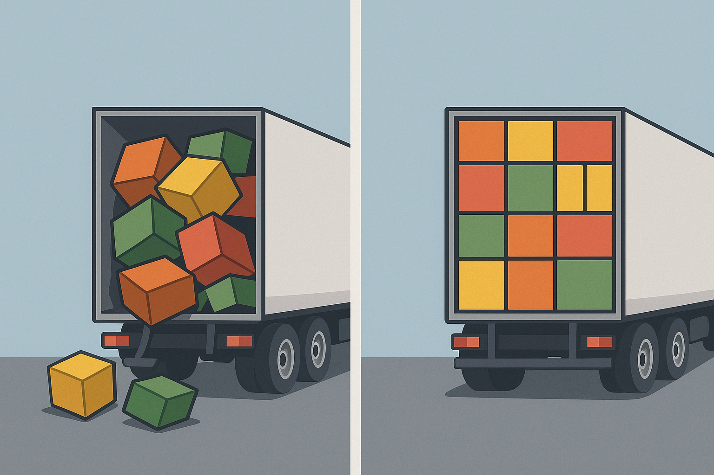
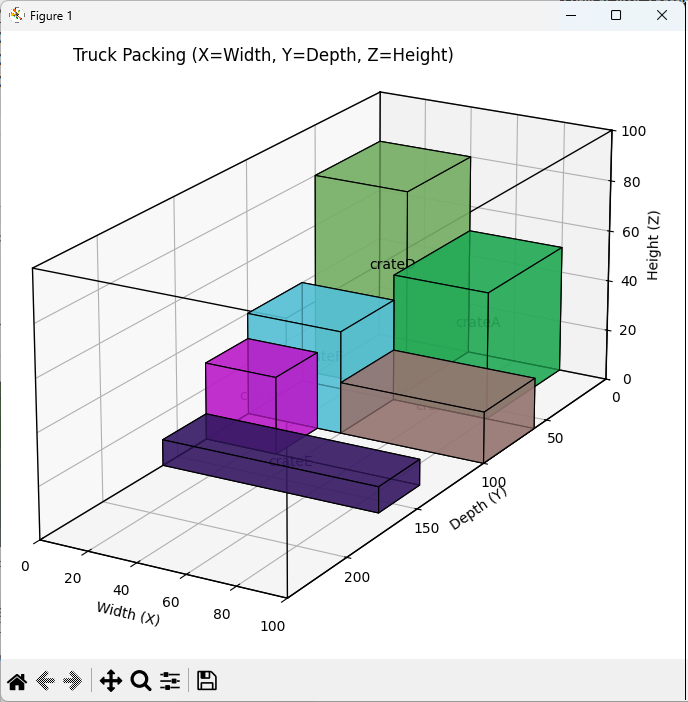

+++
title = "From Ice Shows to Algorithms: Cracking the Truck-Packing Problem"
date = '2025-08-20T09:00:00-07:00'
draft = false
categories = ["Programming", "Optimization"]
tags = [
"Python",
"3D Bin Packing",
"Algorithms",
"AI",
"Modeling",
"Heuristics",
"Matplotlib"
]
listThumb = "three-d-packing.png"
+++

<figure style="float: right; margin: 0 20px 10px 20px; width: 250px; text-align: center;">
  
  <figcaption style="font-size: 0.9em; color: #555; margin-top: 5px;">
    <em>How do you fit it all in?</em>
  </figcaption>
</figure>

My first full-time programming job was for **Holiday on Ice**, an international ice show. While I focused mainly on back office systems such as accounting, itinerary, and box office reporting, I knew that one of the biggest technical challenges faced by the show's crew was efficiently loading trucks for the next city.  

---

> *"Given the dimensions of a truck and a list of containers (with their dimensions and weight), in what order, position, and orientation should you pack the truck?"*  

---

One day, the controller asked me if I could code a system that took, as input, the trucks' **3D dimensions** and the **3D dimensions (and weight)** of every object to be packed. Back in the **Turbo Pascal** era, exploring 3D packing was painful. Today, with **Python** and **AI-assisted scaffolding**, it's surprisingly approachable.  

<!--more-->

This same problem shows up anywhere people need to fit things into finite 3D spaces:

- **Air cargo**: Loading Unit Load Devices (ULDs - aircraft pallets and containers)
- **Concert tours**: Packing road cases into trailers and stage trucks
- **E-commerce fulfillment**: Fitting cartons onto pallets and into shipping containers
- **Furniture / equipment moves**: Loading mixed-size items into moving trucks or pods
- **Shipping & logistics**: Optimizing Less-Than-Truckload (LTL) and Full-Truckload (FTL) loads
- **Warehouse slotting**: Assigning products to rack/bin locations to balance space use and picking efficiency

--- 

## The Thought Experiment

Imagine a truck interior sized **H × W × D** (height, width, depth) and a set of boxes with **height, width, depth, and weight**. The challenge:  

- **Maximize space usage** while avoiding overlap.  
- **Respect the truck bounds** (no sticking out).  
- Optionally **consider weight** and stacking rules.  

Real-world simple? Not really. Computationally, it's a classic **3D bin-packing** problem. On the scale of computational complexity, this problem is extremely difficult (**NP-hard**), meaning there's no known fast way to always find the perfect solution. Instead, we rely on heuristics, which are clever shortcuts that deliver good (though not guaranteed optimal) results quickly.  

It's like trying to figure out every possible way to load groceries into your car trunk. You could test every arrangement, but that would take forever, so instead you look for smart tricks to get a good result quickly. Tricks such as loading heavy items first, stacking boxes neatly, and filling gaps with small bags.  

# Modeling the Packing Problem

To simulate the problem, we make the following simplifications:

**Assumptions:**

- The truck is a perfect cuboid with fixed dimensions.
- Each box is also a cuboid with (height, width, depth, weight).
- Boxes may only be rotated in **axis-aligned orientations** (6 total).  
- Free space is tracked as rectangular subspaces (split after each placement).
- Goal: maximize volume utilization, while optionally considering stacking rules.

---

## Using AI to Scaffold the Code

I start by prompting an AI model to sketch out a basic packing algorithm:

```prompt
Write a Python script that, given the dimensions of a truck 
(height, width, depth) and a dictionary of objects with 
height, width, depth, and weight, produces a packing order. 
The script should output 3D positions and orientations for 
each object.
```

The model produces a working draft. As with most AI-generated code, it needs refinement so blocks don't float or extend beyond the truck's limits. These edits include better variable and function naming, clearer placement logic, and fixing layout issues. Still, this first generation saves me hours of scaffolding and gives me a strong foundation to improve upon. What follows is the refined version.

```python
from dataclasses import dataclass
from typing import List, Tuple, Dict

@dataclass
class Dimensions:
    height: float
    width: float
    depth: float

@dataclass
class Placement:
    name: str
    size: Dimensions
    weight: float
    
    # (x, y, z) = (width, height, depth)
    position: Tuple[float, float, float] 

def pack_truck(
    truck: Dimensions,
    items: Dict[str, Dict]
) -> Tuple[List[Placement], List[str], List[str]]:
    placements: List[Placement] = []
    skipped: List[str] = []
    notes: List[str] = []

    # Shelf-style cursor positions using (x, y, z) 
    # with y=height and z=depth
    x, y, z = 0.0, 0.0, 0.0

    # Tallest item in this layer (height consumed)
    current_layer_height = 0.0  

    # Deepest item in the current row
    row_depth = 0.0

    # Sort by volume then weight (desc) to be more 
    # stable/deterministic
    items_sorted = sorted(
        items.items(),
        key=lambda kv: (
            kv[1]["height"] * kv[1]["width"] * kv[1]["depth"],
            kv[1]["weight"],
        ),
        reverse=True,
    )

    for name, item in items_sorted:
        h, w, d, wt = (item["height"], 
                      item["width"], 
                      item["depth"], 
                      item["weight"])

        # If it doesn't fit in the current row across width,
        # wrap to next row (advance depth z)
        if x + w > truck.width:
            x = 0.0
            z += row_depth
            row_depth = 0.0

        # If it doesn't fit within remaining depth,
        # start a new layer (advance height y)
        if z + d > truck.depth:
            z = 0.0
            y += current_layer_height
            current_layer_height = 0.0

        # If it doesn't fit within remaining height, skip
        if y + h > truck.height:
            skipped.append(name)
            notes.append(f"{name} skipped: too tall for "
                         "remaining truck height.")
            continue

        # Place the item
        placements.append(
            Placement(
                name=name,
                size=Dimensions(h, w, d),
                weight=wt,
                position=(x, y, z),
            )
        )

        # Update cursors
        x += w
        row_depth = max(row_depth, d)
        current_layer_height = max(current_layer_height, h)

    return placements, skipped, notes

```

---

## Simulation: Packing a Truck

Once the function exists, I test it with a sample truck definition and a dictionary of sample items:

```prompt
Write example code that defines a truck, provides a dictionary 
of items with height, width, depth, and weight, and prints 
the resulting packing plan.
```

The model produces usable code that I edit for clarity and readability.

```python
# ---------- Demo ----------
if __name__ == "__main__":
    truck = Dimensions(height=100.0, width=100.0, depth=240.0)

    items_input = {
        "crateA": {"height": 50, "width": 40, "depth": 60, "weight": 80},
        "crateB": {"height": 30, "width": 30, "depth": 30, "weight": 40},
        "crateC": {"height": 20, "width": 60, "depth": 40, "weight": 50},
        "crateD": {"height": 80, "width": 40, "depth": 50, "weight": 90},
        "crateE": {"height": 10, "width": 90, "depth": 30, "weight": 20},
        "crateF": {"height": 40, "width": 40, "depth": 40, "weight": 60},
    }

    placements, skipped, notes = pack_truck(truck, items_input)

    print("== PACK PLAN ==")
    for i, p in enumerate(placements, 1):
        x, y, z = p.position
        print(
            f"{i:02d}. {p.name}: pos=({x:.1f},{y:.1f},{z:.1f}) "
            f"size(HxWxD)=({p.size.height:.1f}x{p.size.width:.1f}x"
            f"{p.size.depth:.1f}) "
            f"weight={p.weight:.1f}"
        )

    if skipped:
        print("\nSkipped:", skipped)
    if notes:
        print("\nNotes:")
        for n in notes:
            print("-", n)

    # Visualize the simulated pack
    try:
        plot_truck_packing(truck, placements)
    except Exception as e:
        print("\n(Visualization skipped; matplotlib "
              "may not be installed.)")
        print(e)
```

**Sample Output:**

The packing function produces a sequential plan showing where each crate ends up, including its 3D position, size, and weight. Each line corresponds to one item in the truck, listed in the order it was placed.

```output
== PACK PLAN ==
01. crateD: pos=(0.0,0.0,0.0) size(HxWxD)=(80.0x40.0x50.0) weight=90.0
02. crateA: pos=(40.0,0.0,0.0) size(HxWxD)=(50.0x40.0x60.0) weight=80.0
03. crateF: pos=(0.0,0.0,60.0) size(HxWxD)=(40.0x40.0x40.0) weight=60.0
04. crateC: pos=(40.0,0.0,60.0) size(HxWxD)=(20.0x60.0x40.0) weight=50.0
05. crateB: pos=(0.0,0.0,100.0) size(HxWxD)=(30.0x30.0x30.0) weight=40.0
06. crateE: pos=(0.0,0.0,130.0) size(HxWxD)=(10.0x90.0x30.0) weight=20.0
```

---

## Making the Results Visual

<figure style="float: right; margin: 0 20px 10px 20px; width: 400px; text-align: center;">
  
  <figcaption style="font-size: 0.9em; color: #555; margin-top: 5px;">
    <em>3D visualization of packed items inside the truck, showing width, depth, and height alignment based on a heuristic best-guess for efficiency.</em>
  </figcaption>
</figure>

By plotting the packed truck, we move beyond raw placement data and can see whether the packing logic produces a layout that makes sense in three dimensions. A list of coordinates and sizes may be correct mathematically, but it’s not easy to judge efficiency or orientation without a visual check. A 3D plot gives immediate feedback on how the boxes sit within the container: whether they fit, whether they stack as expected, and how well the available space is being used. This makes it much easier to spot mistakes in the algorithm, such as items standing on the wrong axis, overlapping, or leaving gaps that should have been filled.

The plotting function directly supports this goal by turning the abstract placement data into a clear visual model. The prompt I use ensures that the visualization is both accurate and interpretable. By assigning each box its own color and labeling it at its center, the plot highlights how individual items relate to the container and to each other. In this way, the visualization is not just a cosmetic step, but an integral part of validating and improving the packing heuristic.

```prompt
Write a Python function that takes a truck's dimensions and the placements list, 
and plots the packed truck in 3D using Matplotlib. Each box should have a unique 
color and label.
```

The `plot_truck_packing` function is responsible for visualizing how items are arranged inside the truck. It begins by drawing a wireframe of the container using width, depth, and height as the three axes. It then loops through each placed item, calls `_cuboid_faces_mpl_from_internal` to generate the six visible faces of the box in Matplotlib’s coordinate system, and renders them as colored 3D shapes. Labels are added at the center of each item for clarity, and the axes are labeled and scaled so the proportions match the truck’s real dimensions. Finally, the viewing angle, aspect ratio, and title are set to produce a clear, accurate perspective of the packed load.

```python
# ---------- Visualization ----------
import matplotlib.pyplot as plt
from mpl_toolkits.mplot3d.art3d import Poly3DCollection
import random

def _cuboid_faces_mpl_from_internal(x, y, z, w, h, d):
    """
    Internal coords: x=width, y=height, z=depth
    Matplotlib axes: X=width, Y=depth, Z=height
    Map (x,y,z) -> (X,Y,Z) = (x, z, y)
    """
    # 8 vertices in internal space
    v000 = (x,     y,     z    )
    v100 = (x + w, y,     z    )
    v110 = (x + w, y + h, z    )
    v010 = (x,     y + h, z    )
    v001 = (x,     y,     z + d)
    v101 = (x + w, y,     z + d)
    v111 = (x + w, y + h, z + d)
    v011 = (x,     y + h, z + d)

    def to_mpl(v):
        xi, yi, zi = v
        return [xi, zi, yi]  # (X=width, Y=depth, Z=height)

    V = list(map(to_mpl, [v000, v100, v110, v010, 
                          v001, v101, v111, v011]))
    # faces as quads using transformed verts
    return [
        [V[0], V[1], V[2], V[3]],  # back  (z)
        [V[4], V[5], V[6], V[7]],  # front (z + d)
        [V[0], V[1], V[5], V[4]],  # bottom
        [V[3], V[2], V[6], V[7]],  # top
        [V[1], V[2], V[6], V[5]],  # right
        [V[0], V[3], V[7], V[4]],  # left
    ]

def plot_truck_packing(truck: Dimensions, placements: List[Placement]):
    fig = plt.figure(figsize=(10, 8))
    ax = fig.add_subplot(111, projection="3d")

    # Truck wireframe: bottom (Z=0), top (Z=truck.height)
    # Use (X,Y,Z) = (width, depth, height)
    # Bottom rectangle (Z=0)
    ax.plot([0, truck.width, truck.width, 0, 0],
            [0, 0,           truck.depth,  truck.depth, 0],
            [0, 0,           0,            0,           0],
            "k-", linewidth=1)

    # Top rectangle (Z=truck.height)
    ax.plot([0, truck.width, truck.width, 0, 0],
            [0, 0,           truck.depth,  truck.depth, 0],
            [truck.height]*5,
            "k-", linewidth=1)

    # Vertical edges
    for X, Y in [
        (0, 0),
        (truck.width, 0),
        (truck.width, truck.depth),
        (0, truck.depth),
    ]:
        ax.plot([X, X], [Y, Y], [0, truck.height], "k-", linewidth=1)

    # Draw items
    for p in placements:
        x, y, z = p.position          # internal
        h, w, d = p.size.height, p.size.width, p.size.depth
        faces = _cuboid_faces_mpl_from_internal(x, y, z, w, h, d)
        color = [random.random(), random.random(), random.random()]
        poly = Poly3DCollection(faces, facecolors=color, 
                                edgecolors="k", 
                                linewidths=0.8, 
                                alpha=0.7)
        ax.add_collection3d(poly)

        # Label at center (map to mpl coords)
        Xc, Yc, Zc = x + w/2, z + d/2, y + h/2
        ax.text(Xc, Yc, Zc, p.name, color="k", ha="center", va="center")

    # Labels & limits (match mapped axes)
    ax.set_xlabel("Width (X)")
    ax.set_ylabel("Depth (Y)")
    ax.set_zlabel("Height (Z)")
    ax.set_xlim(0, truck.width)
    ax.set_ylim(truck.depth, 0)
    ax.set_zlim(0, truck.height)

    # Proportional box aspect
    max_range = max(truck.width, truck.depth, truck.height)
    ax.set_box_aspect((truck.width / max_range,
                       truck.depth / max_range,
                       truck.height / max_range))

    # Optional: set a helpful view angle
    ax.view_init(elev=20, azim=-60)

    plt.title("Truck Packing (X=Width, Y=Depth, Z=Height)")
    plt.tight_layout()
    plt.show()
```

---

## What We Learned

So what did we actually learn from tackling this truck-packing problem with AI? First, prompt engineering really does matter. The clearer and more constrained the prompt, the closer the AI's first draft will be to something usable, saving time on rework.

Second, we should remember that this is an **NP-hard problem**. No matter how clever we are, we're not going to get perfect solutions every time. Therefore, the practical goal is heuristics that give us "good enough" answers **fast**.

Finally, we saw how **greedy placement rules** and **guillotine-style splits** can provide practical packing strategies, and how visualization is key to making the results feel intuitive rather than just lines of coordinates.

---

## Exercises for the Reader

The best way to internalize a concept like 3D packing is to get your hands dirty. The following exercises encourage you to tweak the algorithm, adjust the inputs, and even rethink the heuristics. By experimenting, you'll see firsthand how small changes in assumptions or constraints can dramatically affect the packing efficiency.

---

###  Beginner Level: Quick Fixes & Calibration

1. Add weight limits: don't allow heavy crates to stack on fragile ones.

1. Track utilization percentage after each placement.

---

### Intermediate Level: Geometry & Body Modeling

1. Allow full box rotations (beyond axis-aligned).

1. Experiment with different scoring heuristics (e.g., minimize height first).

---

### Advanced Level: Environment & Stochasticity

1. Implement simulated annealing or genetic algorithms to search better packings.

1. Add real-world rules like axle load balancing or fragile stacking.

1. Scale up to thousands of boxes with Monte Carlo heuristics.

---

## Final Thoughts

Packing trucks may seem like grunt work, but it's really a microcosm of **optimization problems**: finite resources, constraints, tradeoffs. The thrill of solving them, especially with today's AI scaffolding, is the same thrill that first drew me to programming back at Holiday on Ice.

---

## Try It Yourself

[Download the full code on GitHub](https://github.com/TomArcher/technical-blog-examples/tree/main/python/three-d-packing)